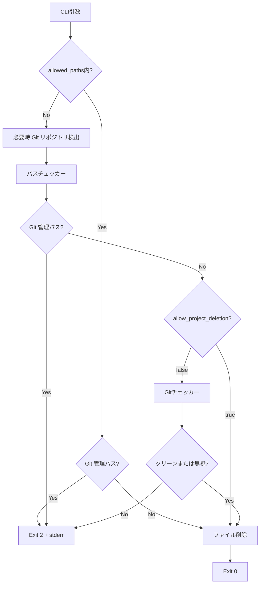
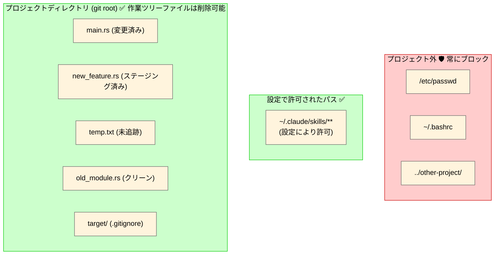
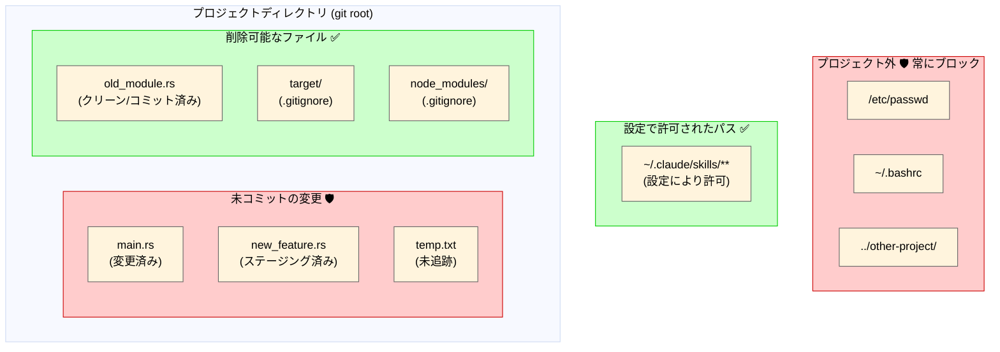

<h1 align="center">safe-rm</h1>

<p align="center">
  <strong>Git対応のファイル保護機能を持つAIエージェント向けセキュア削除CLI</strong>
</p>

<p align="center">
  <a href="https://github.com/owayo/safe-rm/actions/workflows/ci.yml">
    
  </a>
  <a href="https://github.com/owayo/safe-rm/releases/latest">
    
  </a>
  <a href="LICENSE">
    
  </a>
</p>

<p align="center">
  <a href="README.md">English</a> |
  <a href="README.ja.md">日本語</a>
</p>

---

## 概要

`safe-rm` は、AIエージェントがプロジェクト外のファイルや重要な Git 管理メタデータを誤って削除することを防ぐ CLI ツールです。デフォルトではプロジェクト境界を強制し、`.git` などの Git 管理パスをブロックします。**厳格モード**（`allow_project_deletion = false`）ではさらに Git 対応のアクセス制御を有効にし、変更済み・ステージング済み・未追跡ファイルの削除も防止します。

## 機能

- **パス境界チェック**: プロジェクトディレクトリ外のファイル削除をブロック
- **厳格モードの Git ステータス保護**: `allow_project_deletion = false` のとき、変更済み・ステージング済み・未追跡ファイルの削除を防止
- **Git 管理メタデータ保護**: `.git`、gitdir 参照ファイル、bare リポジトリの管理パス、現在のリポジトリの Git 管理メタデータを含む再帰削除に加え、削除対象自身・パスの任意の中間コンポーネント・再帰削除時に配下に存在する任意階層の Git 管理メタデータを常時ブロック。ネストした `.git` ファイル/ディレクトリだけでなく、`.git` コンポーネントを持たない bare リポジトリも検出。コンポーネント比較は ASCII case-insensitive で、macOS APFS などの大文字小文字を区別しないファイルシステムでの `.GIT` 経由バイパスも防止。中間 symlink が `.git` ディレクトリや bare リポジトリを指している場合（例: `gitlink -> nested/.git` のもとで `gitlink/config` を削除）も、親ディレクトリのみを canonicalize して末尾コンポーネントを保持する判定でブロック（symlink 自身の削除はリンクのみを消すため引き続き許可される）
- **コンフリクト対応のステータス判定**: `Status::CONFLICTED` フラグが立ったファイルは、他の index/worktree フラグが立っていない場合でも厳格モードで `Modified` として扱い、未解決のマージコンフリクトが黙って削除されることを防止
- **ネストしたダーティファイル保護**: 厳格モードでは未追跡ディレクトリ配下、ignored/未追跡が混在するディレクトリ配下、ignored ディレクトリ配下の tracked 変更済みファイルも Git 管理外扱いにせず、正しくブロック
- **ディレクトリトラバーサル防止**: `../` の直前成分が「実体として存在する通常ディレクトリ」でないパスは fail-closed で拒否。`link/../victim`（symlink 中間成分）、`missing/../victim`（存在しない中間成分）、`file/../victim`（通常ファイル中間成分）はいずれも OS の path resolution では失敗するが、字句正規化で `victim` に化けてしまう経路をブロック
- **無視ファイルの許可**: `.gitignore` で指定されたファイル（ビルド成果物など）の削除を許可
- **シンボリックリンク安全なGitチェック**: ディレクトリ symlink は辿らず、リンク自体として判定
- **エイリアスパス耐性（包含検証 + allowed_paths + 厳格モード）**: 包含検証と `allowed_paths` 判定では「既存親ディレクトリまで canonicalize + 未作成部分を再結合」、厳格モードの Git チェックでは「非 symlink パスを canonicalize、symlink パスは親ディレクトリのみ canonicalize + リンク自体を判定」として、別名絶対パス経由のバイパスを防止
- **許可パス設定**: 指定ディレクトリのプロジェクト境界チェックと Git ステータスチェックをバイパス（ディレクトリごとの再帰設定）。現在ディレクトリの Git 検出に失敗しても、許可パス削除はそれだけではブロックされない
- **非Gitサポート**: 非Gitディレクトリでも安全に動作
- **ドライランモード**: 実際に削除せずに削除対象をプレビュー
- **決定的なエラー出力**: 単一パス失敗時は stderr を1回だけ出力し、複数パス実行時は失敗した各パスごとに1回ずつ出力

## 要件

- **OS**: macOS, Linux
- **Rust**: 1.85以上（ソースからビルドする場合）

## インストール

### ソースからビルド

```bash
cargo install --path .
```

### バイナリダウンロード

[Releases](https://github.com/owayo/safe-rm/releases) から最新版をダウンロードしてください。

## 使い方

```bash
# 単一ファイルを削除
safe-rm file.txt

# ディレクトリを再帰的に削除
safe-rm -r directory/

# 複数ファイルを削除
safe-rm file1.txt file2.txt file3.txt

# ドライラン（削除対象を表示）
safe-rm -n file.txt

# 強制モード（存在しないファイルを無視）
safe-rm -f nonexistent.txt

# フラグを組み合わせ
safe-rm -rf build/
```

### オプション

| オプション | 説明 |
|------------|------|
| `-r, --recursive` | ディレクトリとその中身を削除 |
| `-f, --force` | 存在しないファイルを無視（エラーなし） |
| `-n, --dry-run` | 削除せずに削除対象を表示 |
| `-h, --help` | ヘルプを表示 |
| `-V, --version` | バージョンを表示 |

### サブコマンド

| サブコマンド | 説明 |
|------------|------|
| `init` | 設定ファイルを `~/.config/safe-rm/config.toml` に生成 |

## 設定

`safe-rm` は `~/.config/safe-rm/config.toml` にオプションの設定ファイルをサポートしています。`SAFE_RM_CONFIG` 環境変数でカスタムパスを指定することもできます。Unix ではこの環境変数を生の OS パスとして読み取るため、非 UTF-8 パスも保持されます。

### セットアップ

```bash
# デフォルト設定ファイルを生成
safe-rm init
# → ~/.config/safe-rm/config.toml を作成
# デフォルトでは ~/.claude/skills と /tmp を再帰的に許可
```

### 設定ファイル形式

```toml
# プロジェクト内のすべてのファイルをGitステータスチェックなしで削除許可
# 境界チェック（プロジェクト外への削除不可）は引き続き有効
# デフォルト: true
allow_project_deletion = true

# このパス配下のすべてのファイル/サブディレクトリを再帰的に許可
# チルダ（~）はホームディレクトリに展開されます
[[allowed_paths]]
path = "~/.claude/skills"
recursive = true

# /tmp 配下を再帰的に許可
[[allowed_paths]]
path = "/tmp"
recursive = true

# このディレクトリの直下のファイルのみ許可
# [[allowed_paths]]
# path = "/tmp/logs"
# recursive = false
```

### フィールド

| フィールド | 型 | デフォルト | 説明 |
|-----------|------|---------|------|
| `allow_project_deletion` | bool | `true` | `true`: プロジェクト内のすべてのファイルをGitステータスチェックなしで削除許可。境界チェックは引き続き有効。 |
| `path` | string | (必須) | 削除を許可するディレクトリパス |
| `recursive` | bool | `false` | `true`: ネストされたすべてのファイル/サブディレクトリを許可。`false`: 直下のファイルのみ。 |

### 動作

- **`allow_project_deletion = true`（デフォルト）**: プロジェクト内の作業ツリーファイルは Git ステータスチェックなしで削除可能。`.git` などの Git 管理パスと、ネストしたリポジトリを含む任意リポジトリの Git 管理メタデータを含む再帰削除は引き続きブロック。
- **`allow_project_deletion = false`**: クリーン（コミット済み）または無視された作業ツリーファイルのみ削除可能。ignored な親ディレクトリ配下にある場合でも未コミットの変更は保護され、Git 管理パスも引き続きブロック。`allowed_paths` にマッチするパスは、現在のリポジトリの index を読めない場合や cwd の Git 管理情報を開けない場合でも Git ステータスチェックをバイパス。
- `allowed_paths` にマッチするパスは、プロジェクト境界チェックと Git ステータスチェックをバイパスするが、任意リポジトリの Git 管理メタデータ保護はバイパスできない。現在リポジトリの Git 管理メタデータは Git 検出に成功した場合に追加で確認し、cwd の Git 検出失敗だけでは許可パス削除を止めない。中間 symlink が `.git` や bare リポジトリ管理領域へ解決される場合は引き続きブロックし、symlink 自身の削除はリンクだけを消すため許可する。未作成パスでも既存親ディレクトリまで canonicalize して別名パス差異を吸収
- `recursive` フラグでサブディレクトリの扱いを制御:
  - `recursive = true`: `/path/to/dir/sub/deep/file.txt` も許可
  - `recursive = false`: `/path/to/dir/file.txt`（直下のファイル）のみ許可
- 設定ファイルが**存在しない**場合は permissive デフォルト（`allow_project_deletion = true`、許可パスなし）にフォールバック。設定ファイルが**存在するが読み込み/パースに失敗**した場合は、利用者が意図した strict 設定が構文エラーで無効化されないよう、fail-closed で strict モード（`allow_project_deletion = false`、許可パスなし）にフォールバック
- 設定で許可された削除には `(allowed by config)` の注釈が出力に表示

### 例

```bash
# `safe-rm init` が生成するデフォルト設定:
# allowed_paths = [
#   { path = "~/.claude/skills", recursive = true },
#   { path = "/tmp", recursive = true },
# ]

# 現在のプロジェクト外でも動作:
safe-rm ~/.claude/skills/my-skill/rules.md
# removed: /Users/owa/.claude/skills/my-skill/rules.md (allowed by config)

safe-rm -r ~/.claude/skills/old-skill/
# removed: /Users/owa/.claude/skills/old-skill/ (allowed by config)
```

## アーキテクチャ


```mermaid
flowchart TB
    CLI[CLI引数] --> ConfigCheck{allowed_paths内?}
    ConfigCheck -->|Yes| AllowedGitMetaCheck{Git 管理パス?}
    AllowedGitMetaCheck -->|Yes| Exit2[Exit 2 + stderr]
    AllowedGitMetaCheck -->|No| Delete[ファイル削除]
    ConfigCheck -->|No| GitOpen[必要時 Git リポジトリ検出]
    GitOpen --> PathCheck[パスチェッカー]
    PathCheck --> GitMetaCheck{Git 管理パス?}
    GitMetaCheck -->|Yes| Exit2
    GitMetaCheck -->|No| ProjectCheck{allow_project_deletion?}
    ProjectCheck -->|true| Delete
    ProjectCheck -->|false| GitCheck[Gitチェッカー]
    GitCheck --> Result{クリーンまたは無視?}
    Result -->|Yes| Delete
    Result -->|No| Exit2
    Delete --> Exit0[Exit 0]
```

### 安全レイヤー

1. **Git 管理メタデータ保護**: `.git`、gitdir 参照ファイル、bare リポジトリの管理パス、および Git 管理メタデータを含む再帰削除は、設定に関係なく常に削除をブロック。再帰的なメタデータ探索でディレクトリエントリを読み取れない場合も fail-closed でブロック。
2. **パス境界チェック**: `allowed_paths` 以外のすべてのパスがプロジェクトディレクトリ（Gitリポジトリルート、Git外の場合はcwd）内に解決されることを、再帰的なメタデータ探索より先に確認。存在しない削除対象でも、既存の親ディレクトリまで canonicalize して別名パス差異（repo symlink 別名、`/var` と `/private/var` など）を吸収。
3. **Git保護**: `allow_project_deletion = false` の場合、ダーティファイル（変更済み/ステージング済み/未追跡）の削除をブロック。未追跡ディレクトリの深い階層にあるファイルも対象
4. **再帰チェック**: 実ディレクトリの場合、含まれるすべてのファイルを検証。ignored な子孫ファイルは削除可能だが、ignored な親ディレクトリが tracked な変更済み/ステージング済みファイルや未追跡の兄弟ファイルを隠すことはない
5. **Fail-Closed**: ディレクトリ走査中のエラー（エントリ列挙エラーを含む）、`allowed_paths` 外の削除経路で必要になる `Repository::discover()` 由来の Git API エラー（壊れた `.git` / 権限不足 / I/O エラー等）、`NotFound` 判定時の祖先メタデータ確認エラー、および設定ファイル読込/パースエラー時は削除をブロックまたは strict モードへフォールバック。`NotFound` は `.git`/bare リポジトリの祖先がなく、祖先確認自体にも成功した場合のみ非 Git として扱う。`allowed_paths` は Git 管理メタデータ保護を維持しつつ、現在ディレクトリの Git 検出成功は必須にしない
6. **不正な親ディレクトリ参照ガード**: `..` の直前成分が「実体として存在する通常ディレクトリ」でないパス（symlink・通常ファイル・存在しない・読み取り不能・特殊ファイル）は削除前に fail-closed で拒否。`link/../victim`・`missing/../victim`・`file/../victim` が字句正規化で別ファイルへすり替わって削除される経路をブロック
7. **エイリアスパス対策**: 包含検証と `allowed_paths` 判定では既存親ディレクトリまで canonicalize して未作成部分を再結合し、Gitチェックでは非symlinkパスを canonicalize 比較し、symlink パスは「親ディレクトリのみ canonicalize + リンク自体を判定」することで、repo symlink 別名や `/var` と `/private/var` の差異による回避を防止

### ファイルシステムと削除可能スコープ

#### デフォルトモード (`allow_project_deletion = true`)


```mermaid
%%{init: {'theme': 'base', 'themeVariables': { 'lineColor': '#666666', 'primaryTextColor': '#000000', 'primaryBorderColor': '#666666' }}}%%
flowchart TB
    subgraph outside["プロジェクト外 🛡️ 常にブロック"]
        etc["/etc/passwd"]
        home["~/.bashrc"]
        other["../other-project/"]
    end

    subgraph allowed["設定で許可されたパス ✅"]
        skills["~/.claude/skills/**<br/>(設定により許可)"]
    end

    subgraph project["プロジェクトディレクトリ (git root) ✅ 作業ツリーファイルは削除可能"]
        modified["main.rs (変更済み)"]
        staged["new_feature.rs (ステージング済み)"]
        untracked["temp.txt (未追跡)"]
        clean["old_module.rs (クリーン)"]
        ignored["target/ (.gitignore)"]
    end

    style outside fill:#ffcccc,stroke:#cc0000,color:#000000
    style allowed fill:#ccffcc,stroke:#00cc00,color:#000000
    style project fill:#ccffcc,stroke:#00cc00,color:#000000
```

| ファイル | 削除可能 | 理由 |
|----------|----------|------|
| `old_module.rs` (クリーン) | ✅ はい | プロジェクト内 |
| `target/` (無視) | ✅ はい | プロジェクト内 |
| `main.rs` (変更済み) | ✅ はい | プロジェクト内 (allow_project_deletion=true) |
| `temp.txt` (未追跡) | ✅ はい | プロジェクト内 (allow_project_deletion=true) |
| `~/.claude/skills/foo` | ✅ はい | 設定により許可（recursive） |
| `.git/` | ❌ いいえ | Git 管理メタデータは常時保護 |
| `./` または repo root に `-r` | ❌ いいえ | 再帰削除が Git 管理メタデータを含む |
| `/etc/passwd` | ❌ いいえ | プロジェクトディレクトリ外 |
| `../other-project/` | ❌ いいえ | パストラバーサルをブロック |

#### 厳格モード (`allow_project_deletion = false`)


```mermaid
%%{init: {'theme': 'base', 'themeVariables': { 'lineColor': '#666666', 'primaryTextColor': '#000000', 'primaryBorderColor': '#666666' }}}%%
flowchart TB
    subgraph outside["プロジェクト外 🛡️ 常にブロック"]
        etc["/etc/passwd"]
        home["~/.bashrc"]
        other["../other-project/"]
    end

    subgraph allowed["設定で許可されたパス ✅"]
        skills["~/.claude/skills/**<br/>(設定により許可)"]
    end

    subgraph project["プロジェクトディレクトリ (git root)"]
        subgraph dirty["未コミットの変更 🛡️"]
            modified["main.rs<br/>(変更済み)"]
            staged["new_feature.rs<br/>(ステージング済み)"]
            untracked["temp.txt<br/>(未追跡)"]
        end

        subgraph deletable["削除可能なファイル ✅"]
            clean["old_module.rs<br/>(クリーン/コミット済み)"]
            ignored["target/<br/>(.gitignore)"]
            nodemod["node_modules/<br/>(.gitignore)"]
        end
    end

    style outside fill:#ffcccc,stroke:#cc0000,color:#000000
    style allowed fill:#ccffcc,stroke:#00cc00,color:#000000
    style dirty fill:#ffcccc,stroke:#cc0000,color:#000000
    style deletable fill:#ccffcc,stroke:#00cc00,color:#000000
```

| ファイル | 削除可能 | 理由 |
|----------|----------|------|
| `old_module.rs` (クリーン) | ✅ はい | コミット済み、`git checkout` で復元可能 |
| `target/` (無視) | ✅ はい | `.gitignore` に記載、ビルド成果物 |
| `node_modules/` (無視) | ✅ はい | `.gitignore` に記載、依存関係 |
| `~/.claude/skills/foo` | ✅ はい | 設定により許可（recursive） |
| `.git/` | ❌ いいえ | Git 管理メタデータは常時保護 |
| `./` または repo root に `-r` | ❌ いいえ | 再帰削除が Git 管理メタデータを含む |
| `main.rs` (変更済み) | ❌ いいえ | 未コミットの変更が失われる |
| `new_feature.rs` (ステージング済み) | ❌ いいえ | コミット待ちの内容が失われる |
| `temp.txt` (未追跡) | ❌ いいえ | Git履歴になく、復元不可能 |
| `/etc/passwd` | ❌ いいえ | プロジェクトディレクトリ外 |
| `../other-project/` | ❌ いいえ | パストラバーサルをブロック |

**重要ポイント**:
- プロジェクト外のファイルは**常にブロック**（設定に関係なく）
- `.git` などの Git 管理メタデータは**常にブロック**（設定に関係なく）。現在のリポジトリルートの再帰削除も対象
- **デフォルトモード (`allow_project_deletion = true`)**: プロジェクト内の作業ツリーファイルは削除可能（AIエージェントに最適）
- **厳格モード (`allow_project_deletion = false`)**: クリーン（コミット済み）または無視された作業ツリーファイルのみ削除可能
- **設定で許可されたパス**は境界チェックと Git ステータスチェックをバイパスするが、Git 管理メタデータ保護はバイパスしない（`~` 展開対応）

## 終了コード

| コード | 意味 | 例 |
|--------|------|-----|
| 0 | 成功 | ファイル削除、ドライラン完了 |
| 1 | 操作エラー | ファイルが見つからない、-rなしでディレクトリ、I/Oエラー、部分的失敗 |
| 2 | セキュリティブロック | ダーティファイル、プロジェクト外、ディレクトリ読み取りエラー（fail-closed） |

## Claude Code 統合

Claude Code のフックで `rm`/`rmdir` コマンドを `safe-rm` にリダイレクトします。

### フック設定

Claude Code の設定ファイル（例: `~/.claude/settings.json` または `.claude/settings.json`）に追加:

```json
{
  "hooks": {
    "PreToolUse": [
      {
        "matcher": "Bash",
        "hooks": [
          {
            "type": "command",
            "command": "jq -r '.tool_input.command // \"\"' | grep -qE '^rm(dir)?\\b' && { echo '🚫 Use safe-rm instead: safe-rm <file> (validates Git status and path containment). Only clean/ignored files in project allowed.' >&2; exit 2; }; exit 0"
          }
        ]
      }
    ]
  }
}
```

このフック:
1. stdin の JSON から `rm`/`rmdir` コマンドを検出
2. 終了コード2でブロックし、ガイダンスメッセージを Claude に表示
3. Claude は安全な削除のために `safe-rm <file>` を直接使用

### CLAUDE.md への記載

`CLAUDE.md` に追加:

```markdown
## ファイル削除ルール

- `rm` や `rmdir` は使用禁止（安全のため制限されています）
- ファイル削除には `safe-rm <file>` または `safe-rm -r <directory>` を使用
- `safe-rm` はファイルが安全に削除可能か自動検証します（Git でコミット済みまたは無視されたファイル）
- `safe-rm` が失敗した場合、そのファイルは未コミットの変更があるか、プロジェクト外にあります

### 使用例
- ビルド成果物を削除: `safe-rm -r target/`
- 古いファイルを削除: `safe-rm old_module.rs`
- 削除対象をプレビュー: `safe-rm -n file.txt`
```

## Git ステータス判定マトリクス

### デフォルトモード (`allow_project_deletion = true`)

| ファイルステータス | 削除可能? | 理由 |
|-------------------|-----------|------|
| すべて（プロジェクト内） | はい | `allow_project_deletion = true` はGitチェックをスキップ |
| プロジェクト外 | いいえ | 設定に関わらず常にブロック |

### 厳格モード (`allow_project_deletion = false`)

| ファイルステータス | 削除可能? | 理由 |
|-------------------|-----------|------|
| Clean | はい | コミット済みで `git checkout` で復元可能 |
| Modified | いいえ | コミットされていない変更が失われる |
| Staged | いいえ | コミット待ちの内容が失われる |
| Untracked | いいえ | Git履歴になく、復元不可能 |
| Ignored | はい | ビルド成果物、ソース管理外 |
| プロジェクト外 | いいえ | Git状態に関わらず常にブロック |

**注意**: カレントディレクトリがGitリポジトリでない場合、Gitステータスチェックはスキップされ、プロジェクト内のすべてのファイルが削除可能になります。

## 使用例

### 許可される操作

```bash
# クリーンファイル（コミット済み、変更なし）
safe-rm src/old_module.rs  # Exit 0

# 無視されたファイル（.gitignoreに記載）
safe-rm target/debug/app   # Exit 0
safe-rm -r node_modules    # Exit 0

# 非Gitディレクトリ
safe-rm temp_file.txt      # Exit 0

# ドライラン
safe-rm -n file.txt # Exit 0, "would remove: file.txt" を表示
```

### ブロックされる操作

```bash
# 変更済みファイル
safe-rm src/main.rs
# Exit 2: "未コミットの変更があるファイルは削除できません"

# プロジェクト外
safe-rm /etc/passwd
# Exit 2: "プロジェクト外へのアクセスは禁止されています"

safe-rm ../../../etc/hosts
# Exit 2: "プロジェクト外へのアクセスは禁止されています"

# 未追跡ファイル
safe-rm new_feature.rs
# Exit 2: "未コミットの変更があるファイルは削除できません"
```

## 開発

```bash
# ビルド
cargo build

# テスト実行
cargo test

# リリースビルド
cargo build --release
```

### テストカバレッジ

- **ユニットテスト**: ライブラリ242件 + バイナリ14件のテストで全モジュールをカバー（CLI、config、error、path_checker、git_checker、init）。Git API エラー時の fail-closed 検証、Git 管理メタデータの再帰探索エラー時の fail-closed 検証、壊れた `.git` や読み取り不可の探索対象で `GitChecker::open()` が `Err(GitError)` を返し permissive 経路へ抜けないこと（`.git` 痕跡がなく、祖先確認にも成功した場合のみ `Ok(None)`）、`Config::load_from_path()` のフェイルクローズ検証（`read_to_string()` の結果で分岐し、`ErrorKind::NotFound` のみ permissive default、その他の I/O エラーと TOML パース失敗は strict モードへフォールバック）、symlink 経由の `..` 親ディレクトリ参照拒否、`FileStatus::is_deletable()` 検証、設定の前方互換性、Unix における `SAFE_RM_CONFIG` の非 UTF-8 パス対応、キャッシュフォールバック動作、空リポジトリ対応、壊れた symlink 検出、複数ステータスの一括取得、キャッシュ使用時の ignored サブディレクトリチェック、`Status::CONFLICTED` を `Modified` にマッピングする検証（単独フラグおよび他フラグとの組み合わせ）、`touches_git_metadata_path`/`is_git_metadata_path` が現在のリポジトリの `.git` を指す symlink 自身の削除を許可しつつ symlink 経由のアクセスはブロックする検証、中間 symlink 経由の `.git`/bare リポジトリバイパス検出（symlink 配下の管理ファイルはブロック、symlink 自身の削除は許可）を含む
- **統合テスト**: 実際のGitリポジトリを使用した139件のテスト（許可/ブロックフロー、厳格モード、シンボリックリンク、repo symlink 別名の cwd からの相対実行を含むエイリアスパス対策、バッチ処理、ドライラン厳格モード、特殊ファイル名、forceフラグとダーティファイルの複合ケース、ネスト未追跡ディレクトリのブロック、ドライラン+フォース複合、空ディレクトリ処理、バッチセキュリティエラー優先、設定の複合テスト、strict mode + force フラグの複合テスト、`..` コンポーネントを含む相対パス検証、バッチ全ダーティの終了コード検証、allowed_paths ディレクトリ自体の削除挙動検証、2パスバッチの終了コード優先度検証、symlink-to-directory の非再帰削除、Git index 破損時の fail-closed 検証、設定ファイル読込/パースエラー時の strict モードフォールバック検証（読めない/壊れた config は permissive default に倒れず未追跡削除をブロックする）、3パスバッチの終了コード優先度検証、ドライランのファイルシステム非変更保証、設定ファイルのエッジケース、壊れた symlink のデフォルト/厳格モード対応、空リポジトリ厳格モード、バッチ force フラグ複合、allowed_paths ドライラン注釈、symlink 経由の `..` 親ディレクトリ参照拒否、中間 symlink で `.git`/bare リポジトリ配下を指す削除のブロック）

## コントリビューション

コントリビューションを歓迎します！お気軽にプルリクエストを送信してください。

## セキュリティ

セキュリティの脆弱性を発見した場合は、[GitHub Issues](https://github.com/owayo/safe-rm/issues) から報告してください。

## ライセンス

[MIT](LICENSE)
