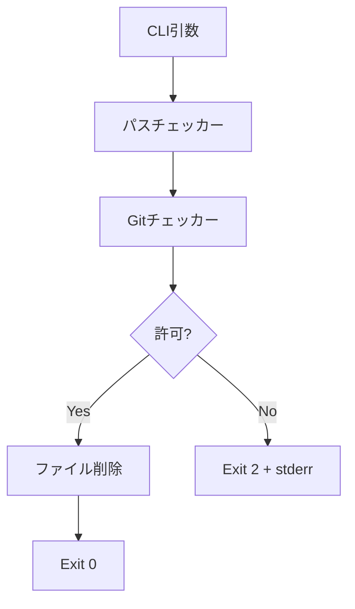
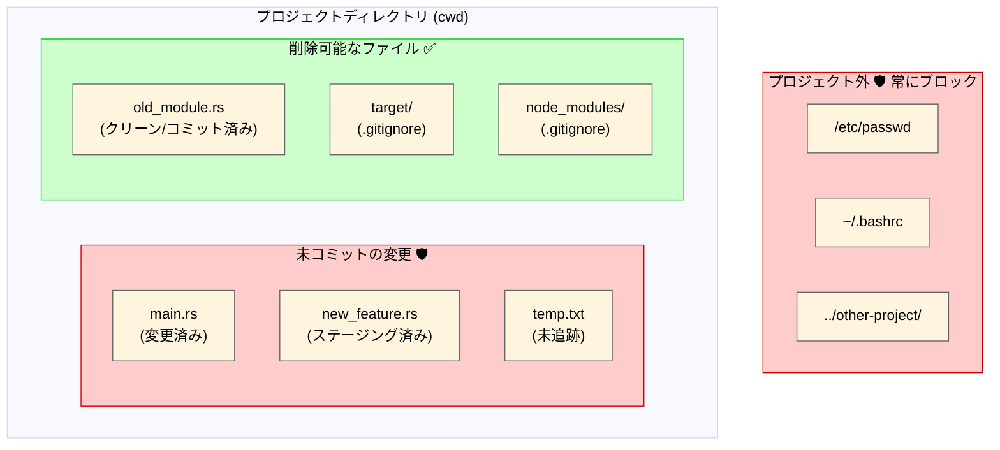

<h1 align="center">safe-rm</h1>

<p align="center">
  <strong>Git対応のファイル保護機能を持つAIエージェント向けセキュア削除CLI</strong>
</p>

<p align="center">
  <a href="https://github.com/owayo/safe-rm/actions/workflows/ci.yml">
    
  </a>
  <a href="https://github.com/owayo/safe-rm/releases/latest">
    
  </a>
  <a href="LICENSE">
    
  </a>
</p>

<p align="center">
  <a href="README.md">English</a> |
  <a href="README.ja.md">日本語</a>
</p>

---

## 概要

`safe-rm` は、AIエージェントがコミットされていない作業やプロジェクト外のファイルを誤って削除することを防ぐCLIツールです。**Git対応のアクセス制御**を実施し、カレントディレクトリ内のクリーンまたは無視されたファイルのみ削除を許可します。

## 機能

- **パス境界チェック**: プロジェクトディレクトリ外のファイル削除をブロック
- **Gitステータス保護**: 変更済み、ステージング済み、未追跡ファイルの削除を防止
- **ディレクトリトラバーサル防止**: `../` によるエスケープ試行をブロック
- **無視ファイルの許可**: `.gitignore` で指定されたファイル（ビルド成果物など）の削除を許可
- **非Gitサポート**: 非Gitディレクトリでも安全に動作
- **ドライランモード**: 実際に削除せずに削除対象をプレビュー

## 要件

- **OS**: macOS, Linux
- **Rust**: 1.70以上（ソースからビルドする場合）

## インストール

### ソースからビルド

```bash
cargo install --path .
```

### バイナリダウンロード

[Releases](https://github.com/owayo/safe-rm/releases) から最新版をダウンロードしてください。

## 使い方

```bash
# 単一ファイルを削除
safe-rm file.txt

# ディレクトリを再帰的に削除
safe-rm -r directory/

# 複数ファイルを削除
safe-rm file1.txt file2.txt file3.txt

# ドライラン（削除対象を表示）
safe-rm -n file.txt

# 強制モード（存在しないファイルを無視）
safe-rm -f nonexistent.txt

# フラグを組み合わせ
safe-rm -rf build/
```

### オプション

| オプション | 説明 |
|------------|------|
| `-r, --recursive` | ディレクトリとその中身を削除 |
| `-f, --force` | 存在しないファイルを無視（エラーなし） |
| `-n, --dry-run` | 削除せずに削除対象を表示 |
| `-h, --help` | ヘルプを表示 |
| `-V, --version` | バージョンを表示 |

## アーキテクチャ



### 安全レイヤー

1. **パス境界チェック**: すべてのパスがカレントディレクトリ内に解決されることを確認
2. **Git保護**: ダーティファイル（変更済み/ステージング済み/未追跡）の削除をブロック
3. **再帰チェック**: ディレクトリの場合、含まれるすべてのファイルを検証

### ファイルシステムと削除可能スコープ



| ファイル | 削除可能 | 理由 |
|----------|----------|------|
| `old_module.rs` (クリーン) | ✅ はい | コミット済み、`git checkout` で復元可能 |
| `target/` (無視) | ✅ はい | `.gitignore` に記載、ビルド成果物 |
| `node_modules/` (無視) | ✅ はい | `.gitignore` に記載、依存関係 |
| `main.rs` (変更済み) | ❌ いいえ | 未コミットの変更が失われる |
| `new_feature.rs` (ステージング済み) | ❌ いいえ | コミット待ちの内容が失われる |
| `temp.txt` (未追跡) | ❌ いいえ | Git履歴になく、復元不可能 |
| `/etc/passwd` | ❌ いいえ | プロジェクトディレクトリ外 |
| `../other-project/` | ❌ いいえ | パストラバーサルをブロック |

**重要ポイント**:
- プロジェクト外のファイルは**常にブロック**（Git状態に関係なく）
- Gitリポジトリ内: クリーン（コミット済み）または無視されたファイルのみ削除可能
- 非Gitディレクトリ内: プロジェクト内のすべてのファイルが削除可能（Git保護なし）

## 終了コード

| コード | 意味 | 例 |
|--------|------|-----|
| 0 | 成功 | ファイル削除、ドライラン完了 |
| 1 | 操作エラー | ファイルが見つからない、-rなしでディレクトリ、I/Oエラー、部分的失敗 |
| 2 | セキュリティブロック | ダーティファイル、プロジェクト外、ディレクトリ読み取りエラー（fail-closed） |

## Claude Code 統合

Claude Code のフックで `rm`/`rmdir` コマンドを `safe-rm` にリダイレクトします。

### フック設定

Claude Code の設定ファイル（例: `~/.claude/settings.json` または `.claude/settings.json`）に追加:

```json
{
  "hooks": {
    "PreToolUse": [
      {
        "matcher": "Bash",
        "hooks": [
          {
            "type": "command",
            "command": "jq -r '.tool_input.command // \"\"' | grep -qE '^rm(dir)?\\b' && { echo '🚫 Use safe-rm instead: safe-rm <file> (validates Git status and path containment). Only clean/ignored files in project allowed.' >&2; exit 2; }; exit 0"
          }
        ]
      }
    ]
  }
}
```

このフック:
1. stdin の JSON から `rm`/`rmdir` コマンドを検出
2. 終了コード2でブロックし、ガイダンスメッセージを Claude に表示
3. Claude は安全な削除のために `safe-rm <file>` を直接使用

### CLAUDE.md への記載

`CLAUDE.md` に追加:

```markdown
## ファイル削除ルール

- ファイル削除には `rm` ではなく `safe-rm` を使用
- 削除がブロックされる場合:
  - プロジェクトディレクトリ外のファイル
  - 変更済みファイル（コミットされていない変更）
  - ステージング済みファイル（追加されたがコミットされていない）
  - 未追跡ファイル（Gitに登録されていない）
- Gitリポジトリで削除が許可される場合:
  - クリーンファイル（コミット済みで変更なし）
  - 無視されたファイル（.gitignoreに記載）
- 非Gitディレクトリ内: すべてのファイルが削除可能
- 削除前に `git status` でファイルの状態を確認
- 重要な変更は削除を試みる前にコミット
```

## Git ステータス判定マトリクス

| ファイルステータス | 削除可能? | 理由 |
|-------------------|-----------|------|
| Clean | はい | コミット済みで `git checkout` で復元可能 |
| Modified | いいえ | コミットされていない変更が失われる |
| Staged | いいえ | コミット待ちの内容が失われる |
| Untracked | いいえ | Git履歴になく、復元不可能 |
| Ignored | はい | ビルド成果物、ソース管理外 |
| プロジェクト外 | いいえ | Git状態に関わらず常にブロック |

**注意**: カレントディレクトリがGitリポジトリでない場合、Gitステータスチェックはスキップされ、プロジェクト内のすべてのファイルが削除可能になります。

## 使用例

### 許可される操作

```bash
# クリーンファイル（コミット済み、変更なし）
safe-rm src/old_module.rs  # Exit 0

# 無視されたファイル（.gitignoreに記載）
safe-rm target/debug/app   # Exit 0
safe-rm -r node_modules    # Exit 0

# 非Gitディレクトリ
safe-rm temp_file.txt      # Exit 0

# ドライラン
safe-rm -n file.txt # Exit 0, "would remove: file.txt" を表示
```

### ブロックされる操作

```bash
# 変更済みファイル
safe-rm src/main.rs
# Exit 2: "未コミットの変更があるファイルは削除できません"

# プロジェクト外
safe-rm /etc/passwd
# Exit 2: "プロジェクト外へのアクセスは禁止されています"

safe-rm ../../../etc/hosts
# Exit 2: "プロジェクト外へのアクセスは禁止されています"

# 未追跡ファイル
safe-rm new_feature.rs
# Exit 2: "未コミットの変更があるファイルは削除できません"
```

## 開発

```bash
# ビルド
cargo build

# テスト実行
cargo test

# リリースビルド
cargo build --release
```

### テストカバレッジ

- **ユニットテスト**: 全モジュールをカバーする60件以上のテスト
- **統合テスト**: 実際のGitリポジトリを使用した18件のテスト

## コントリビューション

コントリビューションを歓迎します！お気軽にプルリクエストを送信してください。

## セキュリティ

セキュリティの脆弱性を発見した場合は、[GitHub Issues](https://github.com/owayo/safe-rm/issues) から報告してください。

## ライセンス

[MIT](LICENSE)
