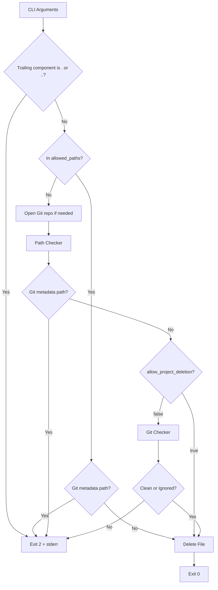
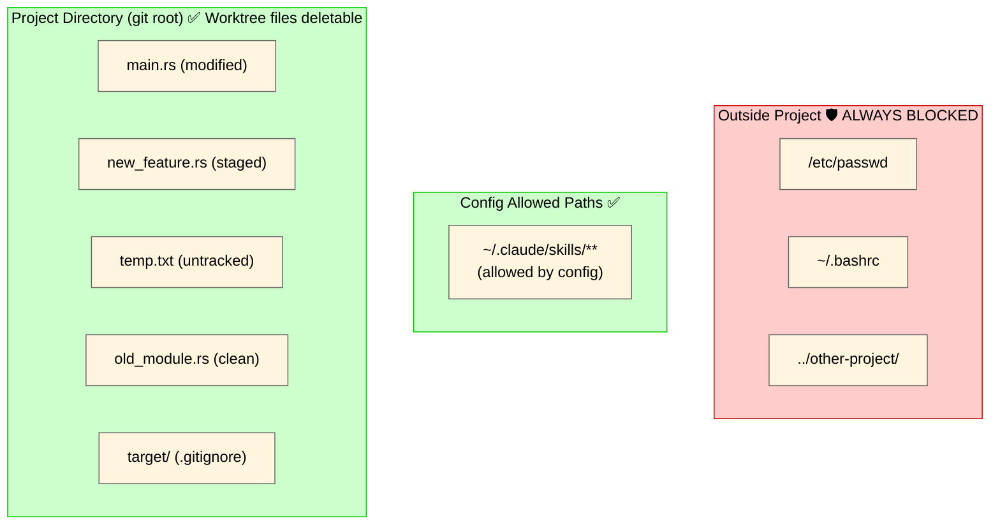
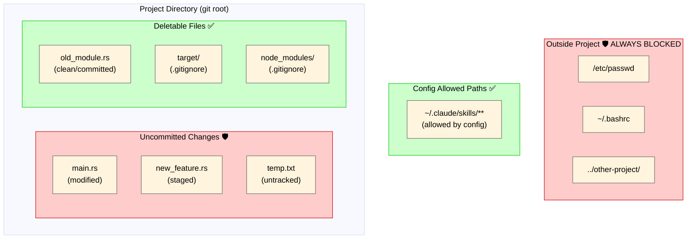

<h1 align="center">safe-rm</h1>

<p align="center">
  <strong>Secure file deletion CLI for AI agents with Git-aware protection</strong>
</p>

<p align="center">
  <a href="https://github.com/owayo/safe-rm/actions/workflows/ci.yml">
    
  </a>
  <a href="https://github.com/owayo/safe-rm/releases/latest">
    
  </a>
  <a href="LICENSE">
    
  </a>
</p>

<p align="center">
  <a href="README.md">English</a> |
  <a href="README.ja.md">日本語</a>
</p>

---

## Overview

`safe-rm` is a CLI tool that prevents AI agents from accidentally deleting files outside the project or critical Git metadata. By default it enforces project containment and blocks Git administrative paths such as `.git`. In **strict mode** (`allow_project_deletion = false`), it also enforces Git-aware access control and blocks deletion of modified, staged, or untracked files.

## Features

- **Path Containment**: Block deletion of files outside project directory
- **Strict-Mode Git Status Protection**: When `allow_project_deletion = false`, prevent deletion of modified, staged, or untracked files. The check uses the Git repository that actually owns each target — both the cwd-side checker and a discovery from the target itself are evaluated, and the deepest workdir that contains the target is selected. This blocks bypasses where (a) cwd is non-Git but the target lives inside a nested Git repository, (b) the cwd repository ignores a nested repository (e.g. via `.gitignore`) so its files would otherwise be treated as `Ignored`, and (c) cwd and the target belong to different Git repositories. If the owning repository redirects its working tree elsewhere (e.g. via `core.worktree`) so that its `workdir()` does not contain the target, the target is treated as `Modified` and blocked fail-closed instead of silently falling through to `NotInRepo`
- **Git Metadata Protection**: Always block `.git`, gitdir indirection files, bare-repository administrative paths, recursive deletes that would include current-repository Git metadata, and nested Git metadata found in the deletion target, any intermediate path component, or its subtree. This includes nested `.git` files/directories and bare repositories that have no `.git` component. Component matching is ASCII case-insensitive to also block `.GIT` bypass attempts on case-insensitive filesystems (e.g., macOS APFS). Intermediate symlinks that resolve to a `.git` directory or bare repository (for example `gitlink -> nested/.git` followed by deleting `gitlink/config`) are also blocked by canonicalizing only the parent directory while keeping the trailing component (so deleting the symlink itself is still permitted because it removes only the link)
- **Conflict-Aware Status Mapping**: Files with the `Status::CONFLICTED` flag are treated as `Modified` in strict mode, even when no other index/worktree flags are set, to prevent silent deletion of unresolved merge conflicts
- **Nested Dirty-File Protection**: Strict-mode checks catch files inside untracked directories, mixed ignored/untracked directories, and tracked modifications inside ignored directories instead of treating them as outside Git
- **Directory Traversal Prevention**: Block `../` escape attempts whenever the component being collapsed by `..` is not a real directory. Patterns such as `link/../victim` (symlink intermediate), `missing/../victim` (non-existent intermediate), and `file/../victim` (regular-file intermediate) all fail under the OS path resolver but would otherwise be silently normalized to `victim` by lexical path cleaning; safe-rm rejects them fail-closed
- **Dangling Intermediate Symlink Guard**: Block paths whose intermediate component is an unresolvable symlink (for example `dangling/child.txt`) before metadata lookup. A final dangling symlink itself remains deletable because removing it only removes the link entry
- **`.` / `..` Operand Rejection**: Reject operands whose trailing component is `.` or `..` (`.`, `./`, `..`, `../`, `sub/.`, `sub/..`, `/abs/path/..`), matching what POSIX `rm` does — it writes a diagnostic and does nothing with such an operand. Without this guard `safe-rm -r .` would delete the current directory itself and `safe-rm -r ..` its parent, making the proxy more destructive than the `rm` it replaces. The check runs before normalization, `allowed_paths` matching, and `-f`, so neither an allowed path nor force can bypass it. Ordinary dot-prefixed names such as `.hidden`, `...`, and `..foo` remain deletable. On Windows, drive-relative forms (`C:.`, `C:..`) are rejected as well
- **Ignored File Passthrough**: Allow deletion of `.gitignore`d files (build artifacts, etc.). A file that matches a `.gitignore` pattern but is force-added (`git add -f`) and therefore tracked is still protected when it has uncommitted changes — status is resolved before the ignore check, so a tracked, dirty file is never misclassified as `Ignored`
- **Symlink-Safe Git Checks**: Directory symlinks are checked as links themselves (not traversed)
- **Non-UTF-8 Path Safety**: Git status cache is keyed by raw byte paths (`HashMap<Vec<u8>, FileStatus>`) using `entry.path_bytes()` so non-UTF-8 filenames are still registered. Without this, deletions of non-UTF-8 untracked files inside untracked directories could silently fall through to `NotInRepo` and become deletable in strict mode. `status_should_ignore()` errors are also fail-closed (treated as `Modified`) instead of being swallowed
- **Alias-Path Safety (Containment + allowed_paths + Strict Mode)**: Containment checks and `allowed_paths` matching canonicalize up to the nearest existing parent and re-append missing segments, while strict-mode Git checks canonicalize non-symlink paths and canonicalize only symlink parents (checking the link itself), blocking bypasses via alternate absolute aliases
- **Configurable Allowed Paths**: Bypass project containment and Git status checks for specified directories (per-directory recursive control), without requiring current-directory Git discovery to succeed
- **Non-Git Support**: Works safely in non-Git directories
- **Dry Run Mode**: Preview what would be deleted without actually deleting
- **Deterministic Error Output**: Single-path failures emit one stderr block, while batch runs emit one error per failed path without duplicating the same message

## Requirements

- **OS**: macOS, Linux
- **Rust**: 1.87+ (for building from source)

## Installation

### From Source

```bash
cargo install --path .
```

### Binary Download

Download the latest release from [Releases](https://github.com/owayo/safe-rm/releases).

## Usage

```bash
# Delete a single file
safe-rm file.txt

# Delete a directory recursively
safe-rm -r directory/

# Delete multiple files
safe-rm file1.txt file2.txt file3.txt

# Dry run (show what would be deleted)
safe-rm -n file.txt

# Force (ignore nonexistent files)
safe-rm -f nonexistent.txt

# Combine flags
safe-rm -rf build/
```

### Options

| Option | Description |
|--------|-------------|
| `-r, --recursive` | Delete directories and their contents |
| `-f, --force` | Ignore nonexistent files (no error) |
| `-n, --dry-run` | Show what would be deleted without deleting |
| `-h, --help` | Show help message |
| `-V, --version` | Show version |

### Subcommands

| Subcommand | Description |
|------------|-------------|
| `init` | Generate config file at `~/.config/safe-rm/config.toml` |

## Configuration

`safe-rm` supports an optional configuration file at `~/.config/safe-rm/config.toml`. You can also specify a custom config path via the `SAFE_RM_CONFIG` environment variable. On Unix, the environment variable is read as a raw OS path so non-UTF-8 paths are preserved.

### Setup

```bash
# Generate a default config file
safe-rm init
# → Creates ~/.config/safe-rm/config.toml
# Defaults allow ~/.claude/skills and /tmp recursively
```

`safe-rm init` does not overwrite an existing config path entry. Existing files and existing symlinks, including dangling symlinks, are treated as already present, and the file is created with create-new semantics so a race cannot redirect the template into another path.

### Config File Format

```toml
# Allow deletion of any file within the current project without Git status checks.
# Containment check (cannot delete outside project) is still enforced.
# Default: true
allow_project_deletion = true

# Recursively allow all files/subdirectories under this path
# Tilde (~) is expanded to home directory
[[allowed_paths]]
path = "~/.claude/skills"
recursive = true

# Recursively allow files/subdirectories under /tmp
[[allowed_paths]]
path = "/tmp"
recursive = true

# Only allow direct children of this directory
# [[allowed_paths]]
# path = "/tmp/logs"
# recursive = false
```

### Fields

| Field | Type | Default | Description |
|-------|------|---------|-------------|
| `allow_project_deletion` | bool | `true` | If `true`, allow deletion of any file within the current project without Git status checks. Containment check is still enforced. |
| `path` | string | (required) | Directory path where deletion is permitted |
| `recursive` | bool | `false` | If `true`, all nested files/subdirectories are allowed. If `false`, only direct children. |

Unknown keys at the top level or inside `allowed_paths` are rejected. This makes misspelled security settings a parse error, which triggers the fail-closed strict-mode fallback instead of silently applying a permissive default. An older `safe-rm` reading a config written for a newer version therefore becomes more restrictive, not less.

### Behavior

- **`allow_project_deletion = true` (default)**: Worktree files inside the project can be deleted without Git status checks. Git administrative paths such as `.git`, and recursive deletion of a path that contains any repository metadata (including nested repositories), are still blocked.
- **`allow_project_deletion = false`**: Only clean (committed) or ignored worktree files can be deleted. Uncommitted changes are protected even when they live under an ignored parent directory, and Git administrative paths are still blocked. Paths matching `allowed_paths` still bypass Git status checks even if the current repository cannot read its index or the current working directory's Git metadata cannot be opened.
- Paths matching `allowed_paths` bypass project containment and Git status checks, but they do **not** bypass Git metadata protection for any repository metadata. Current-repository Git metadata is checked when Git discovery is available, but a Git discovery failure in the current working directory does not by itself block an allowed path. Intermediate symlinks that resolve into `.git` or bare-repository metadata are still blocked, while deleting the symlink itself is allowed because only the link is removed. For nonexistent targets, the nearest existing parent is canonicalized so alias-path differences are still absorbed
- The `recursive` flag controls whether subdirectories are included:
  - `recursive = true`: `/path/to/dir/sub/deep/file.txt` is allowed, and `safe-rm -r /path/to/dir/sub` recursively deletes everything under it through the allowed bypass
  - `recursive = false`: Only direct children such as `/path/to/dir/file.txt` are allowed; a direct-child subdirectory may still be removed via `-r`, but only by falling through to the **standard safety branch** (project containment + strict Git status checks). The allowed bypass intentionally rejects `-r` on a direct-child directory under a non-recursive entry so that nested contents are never deleted without the standard checks running.
- If the config file is **genuinely missing**, `safe-rm` falls back to permissive default (`allow_project_deletion = true`, no allowed paths). If the config location itself cannot be determined, or the config file **exists but cannot be read or parsed** — including a **dangling symlink** at the config path, whether the final or an intermediate path component, which reads back as `NotFound` yet still signals an intended-but-broken config — `safe-rm` falls back to fail-closed strict mode (`allow_project_deletion = false`, no allowed paths) so that an unknown location, syntax error, or broken symlink cannot silently disable intended strict protection. A path whose symlinks still resolve to a not-yet-created file is treated as genuinely missing (permissive), so an unconfigured setup is never over-escalated to strict
- `safe-rm init` protects the config path itself: a dangling symlink at `~/.config/safe-rm/config.toml` is treated as an existing entry and is not followed, so the generated template is never written through the symlink target.
- Output includes `(allowed by config)` annotation for config-permitted deletions

### Example

```bash
# With the default config generated by `safe-rm init`:
# allowed_paths = [
#   { path = "~/.claude/skills", recursive = true },
#   { path = "/tmp", recursive = true },
# ]

# This works even outside the current project:
safe-rm ~/.claude/skills/my-skill/rules.md
# removed: /Users/you/.claude/skills/my-skill/rules.md (allowed by config)

safe-rm -r ~/.claude/skills/old-skill/
# removed: /Users/you/.claude/skills/old-skill/ (allowed by config)
```

## Architecture


```mermaid
flowchart TB
    CLI[CLI Arguments] --> DotCheck{Trailing component is . or ..?}
    DotCheck -->|Yes| Exit2[Exit 2 + stderr]
    DotCheck -->|No| ConfigCheck{In allowed_paths?}
    ConfigCheck -->|Yes| AllowedGitMetaCheck{Git metadata path?}
    AllowedGitMetaCheck -->|Yes| Exit2
    AllowedGitMetaCheck -->|No| Delete[Delete File]
    ConfigCheck -->|No| GitOpen[Open Git repo if needed]
    GitOpen --> PathCheck[Path Checker]
    PathCheck --> GitMetaCheck{Git metadata path?}
    GitMetaCheck -->|Yes| Exit2
    GitMetaCheck -->|No| ProjectCheck{allow_project_deletion?}
    ProjectCheck -->|true| Delete
    ProjectCheck -->|false| GitCheck[Git Checker]
    GitCheck --> Result{Clean or Ignored?}
    Result -->|Yes| Delete
    Result -->|No| Exit2
    Delete --> Exit0[Exit 0]
```

### Safety Layers

1. **Git Metadata Protection**: Always blocks `.git`, gitdir indirection files, bare-repository administrative paths, and recursive deletion of paths that contain Git metadata, even if config would otherwise allow deletion. Bare repositories are detected by their structure markers (`HEAD` entry, `objects/`, `refs/`), so a bare repository with a corrupted `config` (where `Repository::open_bare()` fails) is still protected fail-closed. If a recursive metadata scan cannot read a directory entry, deletion is blocked fail-closed.
2. **Path Containment**: Ensures all non-`allowed_paths` paths resolve within the project directory (Git repository root, or cwd if not a Git repo) before recursive metadata scanning. For nonexistent targets, it canonicalizes the nearest existing parent to absorb alias differences (e.g. repo symlink alias, `/var` vs `/private/var`). Both the deletion entry (the trailing component, without following a trailing symlink) and the fully resolved target must lie inside the project, so an outside symlink pointing into the project (entry is outside) and an inside symlink pointing outside (target is outside) are both blocked; the same two-position check applies to `allowed_paths` matching.
3. **Git Protection**: When `allow_project_deletion = false`, blocks deletion of dirty files (modified/staged/untracked), including files nested under untracked directories. Status is evaluated using the Git repository that actually owns the target — both the cwd-side discovery and a discovery from the target itself are tried, and the deepest workdir containing the target is selected, so cross-repository deletions (cwd non-Git but target inside a nested Git repo, cwd repo ignoring a nested repo, or cwd and target belonging to different repos) are still checked fail-closed
4. **Recursive Check**: For real directories, validates all contained files. Ignored descendants remain deletable, but ignored parent directories do not hide tracked modified/staged files or untracked siblings
5. **Fail-Closed**: Any directory read failure (including entry iteration errors), target metadata classification failure, Git API error from `Repository::discover()` on non-`allowed_paths` deletion paths (e.g. corrupted `.git`, permission errors, I/O failures), worktree canonicalization failure, unreadable metadata probe while classifying a `NotFound`, an unresolvable intermediate symlink, or config location/read/parse error blocks deletion or falls back to strict mode. `NotFound` is treated as non-Git only when no `.git`/bare-repository ancestor is found and the ancestor probe itself succeeds. `allowed_paths` still enforce Git metadata protection, but they do not require current-directory Git discovery to succeed
6. **Unsafe Parent Traversal Guard**: Reject paths whose `..` would collapse a component that is not a real directory before deletion. Patterns such as `link/../victim` (symlink), `missing/../victim` (non-existent), `file/../victim` (regular file), and any component whose metadata cannot be read (permission denied, special file) are rejected fail-closed, preventing lexical normalization from silently retargeting a different on-disk file. Paths below a dangling intermediate symlink are also rejected before deletion, while deleting the dangling symlink entry itself remains allowed
7. **Alias-Path Hardening**: Path containment and `allowed_paths` matching canonicalize the nearest existing parent and reattach missing segments, while Git checks canonicalize non-symlink paths and only parent directories for symlink paths, to avoid alias-based bypasses (e.g. repo symlink alias, `/var` vs `/private/var`)
8. **`.` / `..` Operand Rejection**: Operands whose trailing component is `.` or `..` are rejected with exit code 2 before any normalization, `allowed_paths` matching, or `-f` handling, mirroring POSIX `rm`, which refuses to remove `.` or `..` directories. Name the directory explicitly (`safe-rm -r sub`) instead. Dot-prefixed filenames such as `.hidden` and `...` are unaffected

### File System and Deletable Scope

#### Default Mode (`allow_project_deletion = true`)


```mermaid
%%{init: {'theme': 'base', 'themeVariables': { 'lineColor': '#666666', 'primaryTextColor': '#000000', 'primaryBorderColor': '#666666' }}}%%
flowchart TB
    subgraph outside["Outside Project 🛡️ ALWAYS BLOCKED"]
        etc["/etc/passwd"]
        home["~/.bashrc"]
        other["../other-project/"]
    end

    subgraph allowed["Config Allowed Paths ✅"]
        skills["~/.claude/skills/**<br/>(allowed by config)"]
    end

    subgraph project["Project Directory (git root) ✅ Worktree files deletable"]
        modified["main.rs (modified)"]
        staged["new_feature.rs (staged)"]
        untracked["temp.txt (untracked)"]
        clean["old_module.rs (clean)"]
        ignored["target/ (.gitignore)"]
    end

    style outside fill:#ffcccc,stroke:#cc0000,color:#000000
    style allowed fill:#ccffcc,stroke:#00cc00,color:#000000
    style project fill:#ccffcc,stroke:#00cc00,color:#000000
```

| File | Deletable | Reason |
|------|-----------|--------|
| `old_module.rs` (clean) | ✅ Yes | Inside project |
| `target/` (ignored) | ✅ Yes | Inside project |
| `main.rs` (modified) | ✅ Yes | Inside project (allow_project_deletion=true) |
| `temp.txt` (untracked) | ✅ Yes | Inside project (allow_project_deletion=true) |
| `~/.claude/skills/foo` | ✅ Yes | Allowed by config (recursive) |
| `.git/` | ❌ No | Git administrative metadata is always protected |
| `./` or repo root with `-r` | ❌ No | Recursive deletion would include Git administrative metadata |
| `/etc/passwd` | ❌ No | Outside project directory |
| `../other-project/` | ❌ No | Path traversal blocked |

#### Strict Mode (`allow_project_deletion = false`)


```mermaid
%%{init: {'theme': 'base', 'themeVariables': { 'lineColor': '#666666', 'primaryTextColor': '#000000', 'primaryBorderColor': '#666666' }}}%%
flowchart TB
    subgraph outside["Outside Project 🛡️ ALWAYS BLOCKED"]
        etc["/etc/passwd"]
        home["~/.bashrc"]
        other["../other-project/"]
    end

    subgraph allowed["Config Allowed Paths ✅"]
        skills["~/.claude/skills/**<br/>(allowed by config)"]
    end

    subgraph project["Project Directory (git root)"]
        subgraph dirty["Uncommitted Changes 🛡️"]
            modified["main.rs<br/>(modified)"]
            staged["new_feature.rs<br/>(staged)"]
            untracked["temp.txt<br/>(untracked)"]
        end

        subgraph deletable["Deletable Files ✅"]
            clean["old_module.rs<br/>(clean/committed)"]
            ignored["target/<br/>(.gitignore)"]
            nodemod["node_modules/<br/>(.gitignore)"]
        end
    end

    style outside fill:#ffcccc,stroke:#cc0000,color:#000000
    style allowed fill:#ccffcc,stroke:#00cc00,color:#000000
    style dirty fill:#ffcccc,stroke:#cc0000,color:#000000
    style deletable fill:#ccffcc,stroke:#00cc00,color:#000000
```

| File | Deletable | Reason |
|------|-----------|--------|
| `old_module.rs` (clean) | ✅ Yes | Committed, recoverable via `git checkout` |
| `target/` (ignored) | ✅ Yes | In `.gitignore`, build artifacts |
| `node_modules/` (ignored) | ✅ Yes | In `.gitignore`, dependencies |
| `~/.claude/skills/foo` | ✅ Yes | Allowed by config (recursive) |
| `.git/` | ❌ No | Git administrative metadata is always protected |
| `./` or repo root with `-r` | ❌ No | Recursive deletion would include Git administrative metadata |
| `main.rs` (modified) | ❌ No | Uncommitted changes would be lost |
| `new_feature.rs` (staged) | ❌ No | Pending commit would be lost |
| `temp.txt` (untracked) | ❌ No | Not in Git history, unrecoverable |
| `/etc/passwd` | ❌ No | Outside project directory |
| `../other-project/` | ❌ No | Path traversal blocked |

**Key Points**:
- Files outside the project are **always blocked**, regardless of settings
- Git administrative metadata such as `.git` is **always blocked**, regardless of settings; this includes recursive deletion of the current repository root
- **Default mode (`allow_project_deletion = true`)**: Worktree files inside the project can be deleted (ideal for AI agents)
- **Strict mode (`allow_project_deletion = false`)**: Only clean (committed) or ignored worktree files can be deleted. Deleting a directory also rejects uncommitted deletions that no longer exist on disk (a `git rm`-staged or worktree-deleted tracked file under it), since those are detected via the Git status cache rather than `read_dir`
- **Config allowed paths** bypass containment and Git-status checks, but not Git metadata protection (supports `~` expansion)

## Exit Codes

| Code | Meaning | Examples |
|------|---------|----------|
| 0 | Success | File deleted, dry-run completed |
| 1 | Operation error | File not found, is directory without -r, I/O error, partial failure |
| 2 | Security block | Dirty file, outside project, directory read error (fail-closed) |

## Claude Code Integration

Configure Claude Code hooks to redirect `rm`/`rmdir` commands to `safe-rm`.

### Hook Configuration

Add to your Claude Code settings (e.g., `~/.claude/settings.json` or `.claude/settings.json`):

```json
{
  "hooks": {
    "PreToolUse": [
      {
        "matcher": "Bash",
        "hooks": [
          {
            "type": "command",
            "command": "bash_command=\"$(jq -er '.tool_input.command | strings')\" || { echo '🚫 Could not inspect Bash command; blocking fail-closed.' >&2; exit 2; }; if printf '%s\\n' \"$bash_command\" | grep -qE '(^|[[:space:];|&(`])([^[:space:];|&()]+/)?rm(dir)?([[:space:];|&()<>]|$)'; then echo '🚫 Use safe-rm instead: safe-rm <file> (validates Git status and path containment).' >&2; exit 2; fi; exit 0"
          }
        ]
      }
    ]
  }
}
```

This hook:
1. Conservatively detects literal `rm`/`rmdir` command tokens anywhere in Bash tool calls via stdin JSON, including `cd dir && rm`, `echo ok; rm`, `command rm`, absolute paths such as `/bin/rm`, and command substitutions such as `$(rm file)`
2. Blocks with exit code 2 and shows guidance message to Claude
3. Claude then uses `safe-rm <file>` directly for safe deletion

This hook intentionally fails closed and can also reject a quoted or printed `rm` token. It is not a complete shell parser: dynamically constructed command names can evade textual inspection. Treat it as defense in depth, keep Bash permissions restricted, and require the agent to use `safe-rm` for deletion.

### CLAUDE.md Instructions

Add to your `CLAUDE.md`:

```markdown
## File Deletion Rules

- Do NOT use `rm` or `rmdir`. These are restricted for safety.
- Use `safe-rm <file>` or `safe-rm -r <directory>` to delete files.
- `safe-rm` will automatically verify that the file is safe to delete (committed or ignored in Git).
- If `safe-rm` fails, the file likely has uncommitted changes or is outside the project.

### Examples
- Delete a build artifact: `safe-rm -r target/`
- Delete an old file: `safe-rm old_module.rs`
- Preview what would be deleted: `safe-rm -n file.txt`
```

## Git Status Decision Matrix

### Default Mode (`allow_project_deletion = true`)

| File Status | Deletable? | Reason |
|-------------|------------|--------|
| Any (inside project) | Yes | `allow_project_deletion = true` skips Git checks |
| Outside project | No | Always blocked regardless of settings |

### Strict Mode (`allow_project_deletion = false`)

| File Status | Deletable? | Reason |
|-------------|------------|--------|
| Clean | Yes | Committed and recoverable via `git checkout` |
| Modified | No | Uncommitted changes would be lost |
| Staged | No | Pending commit would be lost |
| Untracked | No | Not in Git history, unrecoverable |
| Ignored | Yes | Build artifacts, not source controlled |
| Outside project | No | Always blocked regardless of Git status |

**Note**: A non-Git current directory does not disable strict checks. `safe-rm` also discovers a repository from each deletion target and selects the deepest worktree containing it. Git status checks are skipped only when the target itself is not in a Git repository; discovery and worktree-resolution errors fail closed.

## Examples

### Allowed Operations

```bash
# Clean file (committed, no changes)
safe-rm src/old_module.rs  # Exit 0

# Ignored file (in .gitignore)
safe-rm target/debug/app   # Exit 0
safe-rm -r node_modules    # Exit 0

# Non-Git directory
safe-rm temp_file.txt      # Exit 0

# Dry run
safe-rm -n file.txt        # Exit 0, shows "would remove: file.txt"
```

### Blocked Operations

```bash
# Modified file
safe-rm src/main.rs
# Exit 2: "未コミットの変更があるファイルは削除できません"

# Outside project
safe-rm /etc/passwd
# Exit 2: "プロジェクト外へのアクセスは禁止されています"

safe-rm ../../../etc/hosts
# Exit 2: "プロジェクト外へのアクセスは禁止されています"

# Untracked file
safe-rm new_feature.rs
# Exit 2: "未コミットの変更があるファイルは削除できません"

# `.` / `..` operands (POSIX rm refuses these too)
safe-rm -r .
# Exit 2: "末尾が '.' または '..' のパスは削除できません"
safe-rm -r sub/..
# Exit 2: "末尾が '.' または '..' のパスは削除できません"
# Name the directory explicitly instead: safe-rm -r sub
```

## Development

```bash
# Build
cargo build

# Run tests
cargo test

# Check the minimum supported Rust version
cargo +1.87.0 check --locked --all-targets --all-features

# Build release
cargo build --locked --release
```

CI verifies the declared minimum Rust version with Rust 1.87.0 and uses the committed `Cargo.lock` for tests, linting, and release builds. Local `make release` and `make install` also enforce the committed lockfile. The release workflow builds the exact dispatch commit on every target before it creates and pushes the release commit and tag.

### Test Coverage

- **Unit Tests**: 285 library unit tests plus 27 binary unit tests covering all modules (CLI, config, error, path_checker, git_checker, init) including fail-closed Git API error handling, fail-closed recursive Git metadata scan errors, worktree canonicalization and target metadata classification errors, recursive detection of `.git` and `.GIT` metadata directories, `convert_status()` mapping `WT_UNREADABLE` and unknown status flags to `Modified` (only the empty/`CURRENT` bitset stays `Clean`), `check_path_with_cache()` blocking directories that contain an on-disk-absent uncommitted deletion (a `git rm`-staged or worktree-deleted tracked file) without over-blocking a sibling directory with a colliding name prefix (`dir` vs `dir2`), selecting the deepest Git workdir that contains a strict-mode target, fail-closed `GitChecker::open()` for corrupted `.git` and unreadable discovery targets (returns `Err(GitError)` whenever any `.git` ancestor is detected or ancestor probing cannot be trusted, so a `NotFound` from `Repository::discover()` never silently downgrades to permissive default), fail-closed `Config::load_from_path()` based on `read_to_string()` results — strict mode fallback when the config location is unknown or the file fails to read or parse, permissive default only when the file is genuinely absent, with a dangling symlink at the config path (final or intermediate component) treated as exists-but-unreadable and escalated to strict while a resolvable symlink to a not-yet-created file stays permissive, symlink-parent `..` traversal rejection including nested `link/child/../../victim` normalization mismatches, dangling intermediate symlink blocking while allowing final dangling symlink deletion, `FileStatus::is_deletable()` validation, unknown config-key rejection, `SAFE_RM_CONFIG` non-UTF-8 path handling on Unix, cache fallback behavior, empty repository handling, broken symlink detection, multiple status type batch retrieval, cached ignored subdirectory checks, `Status::CONFLICTED` mapping to `Modified` (single-flag and combined cases), `touches_git_metadata_path`/`is_git_metadata_path` allowing symlinks pointing at the current `.git` while still blocking deletion through them, intermediate-symlink bypass detection (intermediate symlinks pointing to `.git` or bare repos are blocked when targeting their contents, while deleting the symlink itself is allowed), marker-based bare-repository detection that keeps protecting a bare repo whose `config` is corrupted enough to make `Repository::open_bare()` fail (including a symlink `HEAD` pointing at an unborn ref), and rejection of an allowed-directory symlink whose resolved target lies outside the allowed boundary
- **Integration Tests**: 174 tests with real Git repositories (allow/block flows, strict mode, symlinks, alias-path hardening including relative execution from symlink-alias cwd, batch operations, dry-run in strict mode, special filenames, force flag combined with dirty files, nested untracked directory blocking, dry-run + force combinations, empty directory handling, batch security error precedence, config combination tests, strict mode + force flag combinations, relative paths with `..` components, batch all-dirty exit code verification, allowed_paths directory self-deletion behavior, two-path batch exit code priority, symlink-to-directory non-recursive deletion, Git index corruption fail-closed verification, config read/parse error strict-mode fallback verification (unreadable, corrupted, or unknown-key config no longer downgrades into permissive default), three-path batch exit code priority, dry-run filesystem non-modification guarantee, config edge cases, broken symlink handling in default/strict modes, empty repository strict mode, batch force flag combinations, allowed_paths dry-run annotations, symlink-parent `..` traversal rejection, dangling intermediate symlink blocking, live intermediate symlink containment blocking, recursive `.GIT` metadata blocking, intermediate-symlink-to-`.git`/bare-repository bypass blocking, outside-symlink-pointing-into-project containment blocking, corrupted-config bare-repository HEAD and full recursive deletion blocking, strict-mode blocking of directories that contain a staged or worktree deletion (without over-blocking a clean directory when the deletion is in another directory), config-path dangling symlinks (final or intermediate component) falling back to strict mode, both `allowed_paths` boundary directions (an inside link resolving outside and an outside link resolving inside) being blocked without deleting either endpoint, and `.` / `..` operand rejection (`-r .` not deleting the current directory in a non-Git tree, `-r ..` not deleting the parent from a Git repository grandchild, `-rf .` not being bypassed by force, `-r sub/..` not wiping an `allowed_paths` directory, dot-prefixed names such as `.hidden` and `...` staying deletable, and explicitly named directories such as `-r sub` still being deletable))

- **Project Configuration Test**: 1 regression test ensures the local `release` target keeps `cargo build --locked --release`, so `make release` and `make install` cannot silently rewrite dependency resolution

## Contributing

Contributions are welcome! Please feel free to submit a Pull Request.

## Security

If you discover a security vulnerability, please report it via [GitHub Issues](https://github.com/owayo/safe-rm/issues).

## License

[MIT](LICENSE)
