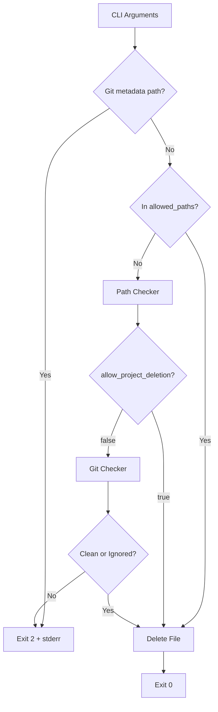
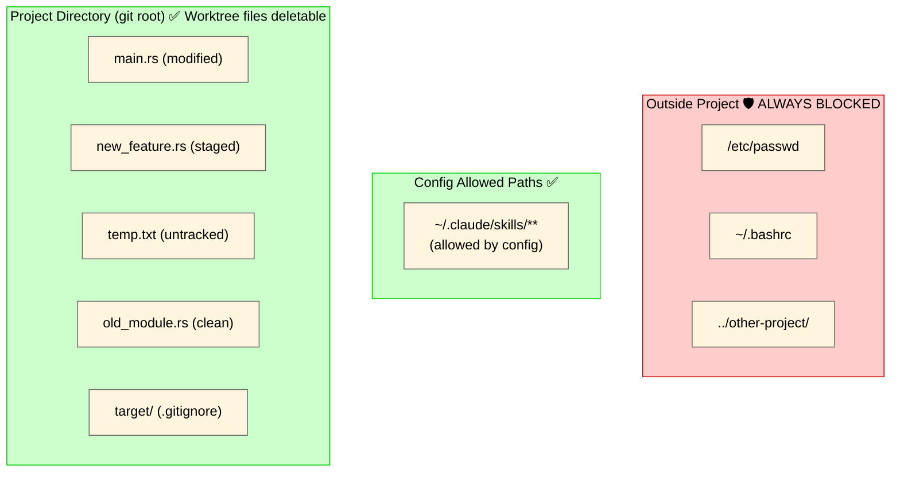
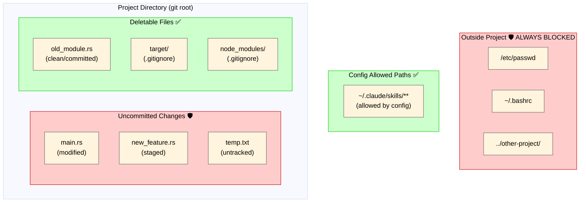

<h1 align="center">safe-rm</h1>

<p align="center">
  <strong>Secure file deletion CLI for AI agents with Git-aware protection</strong>
</p>

<p align="center">
  <a href="https://github.com/owayo/safe-rm/actions/workflows/ci.yml">
    
  </a>
  <a href="https://github.com/owayo/safe-rm/releases/latest">
    
  </a>
  <a href="LICENSE">
    
  </a>
</p>

<p align="center">
  <a href="README.md">English</a> |
  <a href="README.ja.md">日本語</a>
</p>

---

## Overview

`safe-rm` is a CLI tool that prevents AI agents from accidentally deleting files outside the project or critical Git metadata. By default it enforces project containment and blocks Git administrative paths such as `.git`. In **strict mode** (`allow_project_deletion = false`), it also enforces Git-aware access control and blocks deletion of modified, staged, or untracked files.

## Features

- **Path Containment**: Block deletion of files outside project directory
- **Strict-Mode Git Status Protection**: When `allow_project_deletion = false`, prevent deletion of modified, staged, or untracked files
- **Git Metadata Protection**: Always block `.git`, gitdir indirection files, bare-repository administrative paths, recursive deletes that would include current-repository Git metadata, and nested Git metadata found in the deletion target, any intermediate path component, or its subtree. This includes nested `.git` files/directories and bare repositories that have no `.git` component. Component matching is ASCII case-insensitive to also block `.GIT` bypass attempts on case-insensitive filesystems (e.g., macOS APFS). Intermediate symlinks that resolve to a `.git` directory or bare repository (for example `gitlink -> nested/.git` followed by deleting `gitlink/config`) are also blocked by canonicalizing only the parent directory while keeping the trailing component (so deleting the symlink itself is still permitted because it removes only the link)
- **Conflict-Aware Status Mapping**: Files with the `Status::CONFLICTED` flag are treated as `Modified` in strict mode, even when no other index/worktree flags are set, to prevent silent deletion of unresolved merge conflicts
- **Nested Dirty-File Protection**: Strict-mode checks catch files inside untracked directories, mixed ignored/untracked directories, and tracked modifications inside ignored directories instead of treating them as outside Git
- **Directory Traversal Prevention**: Block `../` escape attempts, including `link/../victim` patterns where `..` removes a symlink component and could otherwise make lexical normalization target a different file
- **Ignored File Passthrough**: Allow deletion of `.gitignore`d files (build artifacts, etc.)
- **Symlink-Safe Git Checks**: Directory symlinks are checked as links themselves (not traversed)
- **Alias-Path Safety (Containment + allowed_paths + Strict Mode)**: Containment checks and `allowed_paths` matching canonicalize up to the nearest existing parent and re-append missing segments, while strict-mode Git checks canonicalize non-symlink paths and canonicalize only symlink parents (checking the link itself), blocking bypasses via alternate absolute aliases
- **Configurable Allowed Paths**: Bypass safety checks for specified directories (per-directory recursive control)
- **Non-Git Support**: Works safely in non-Git directories
- **Dry Run Mode**: Preview what would be deleted without actually deleting
- **Deterministic Error Output**: Single-path failures emit one stderr block, while batch runs emit one error per failed path without duplicating the same message

## Requirements

- **OS**: macOS, Linux
- **Rust**: 1.85+ (for building from source)

## Installation

### From Source

```bash
cargo install --path .
```

### Binary Download

Download the latest release from [Releases](https://github.com/owayo/safe-rm/releases).

## Usage

```bash
# Delete a single file
safe-rm file.txt

# Delete a directory recursively
safe-rm -r directory/

# Delete multiple files
safe-rm file1.txt file2.txt file3.txt

# Dry run (show what would be deleted)
safe-rm -n file.txt

# Force (ignore nonexistent files)
safe-rm -f nonexistent.txt

# Combine flags
safe-rm -rf build/
```

### Options

| Option | Description |
|--------|-------------|
| `-r, --recursive` | Delete directories and their contents |
| `-f, --force` | Ignore nonexistent files (no error) |
| `-n, --dry-run` | Show what would be deleted without deleting |
| `-h, --help` | Show help message |
| `-V, --version` | Show version |

### Subcommands

| Subcommand | Description |
|------------|-------------|
| `init` | Generate config file at `~/.config/safe-rm/config.toml` |

## Configuration

`safe-rm` supports an optional configuration file at `~/.config/safe-rm/config.toml`. You can also specify a custom config path via the `SAFE_RM_CONFIG` environment variable. On Unix, the environment variable is read as a raw OS path so non-UTF-8 paths are preserved.

### Setup

```bash
# Generate a default config file
safe-rm init
# → Creates ~/.config/safe-rm/config.toml
# Defaults allow ~/.claude/skills and /tmp recursively
```

### Config File Format

```toml
# Allow deletion of any file within the current project without Git status checks.
# Containment check (cannot delete outside project) is still enforced.
# Default: true
allow_project_deletion = true

# Recursively allow all files/subdirectories under this path
# Tilde (~) is expanded to home directory
[[allowed_paths]]
path = "~/.claude/skills"
recursive = true

# Recursively allow files/subdirectories under /tmp
[[allowed_paths]]
path = "/tmp"
recursive = true

# Only allow direct children of this directory
# [[allowed_paths]]
# path = "/tmp/logs"
# recursive = false
```

### Fields

| Field | Type | Default | Description |
|-------|------|---------|-------------|
| `allow_project_deletion` | bool | `true` | If `true`, allow deletion of any file within the current project without Git status checks. Containment check is still enforced. |
| `path` | string | (required) | Directory path where deletion is permitted |
| `recursive` | bool | `false` | If `true`, all nested files/subdirectories are allowed. If `false`, only direct children. |

### Behavior

- **`allow_project_deletion = true` (default)**: Worktree files inside the project can be deleted without Git status checks. Git administrative paths such as `.git`, and recursive deletion of a path that contains any repository metadata (including nested repositories), are still blocked.
- **`allow_project_deletion = false`**: Only clean (committed) or ignored worktree files can be deleted. Uncommitted changes are protected even when they live under an ignored parent directory, and Git administrative paths are still blocked. Paths matching `allowed_paths` still bypass Git status checks even if the current repository cannot read its index.
- Paths matching `allowed_paths` bypass project containment and Git status checks, but they do **not** bypass Git metadata protection for any repository metadata. For nonexistent targets, the nearest existing parent is canonicalized so alias-path differences are still absorbed
- The `recursive` flag controls whether subdirectories are included:
  - `recursive = true`: `/path/to/dir/sub/deep/file.txt` is allowed
  - `recursive = false`: Only `/path/to/dir/file.txt` is allowed (direct children)
- If the config file is **missing**, `safe-rm` falls back to permissive default (`allow_project_deletion = true`, no allowed paths). If the config file **exists but cannot be read or parsed**, `safe-rm` falls back to fail-closed strict mode (`allow_project_deletion = false`, no allowed paths) so that a user who intended strict mode is not silently downgraded by a syntax error
- Output includes `(allowed by config)` annotation for config-permitted deletions

### Example

```bash
# With the default config generated by `safe-rm init`:
# allowed_paths = [
#   { path = "~/.claude/skills", recursive = true },
#   { path = "/tmp", recursive = true },
# ]

# This works even outside the current project:
safe-rm ~/.claude/skills/my-skill/rules.md
# removed: /Users/owa/.claude/skills/my-skill/rules.md (allowed by config)

safe-rm -r ~/.claude/skills/old-skill/
# removed: /Users/owa/.claude/skills/old-skill/ (allowed by config)
```

## Architecture


```mermaid
flowchart TB
    CLI[CLI Arguments] --> GitMetaCheck{Git metadata path?}
    GitMetaCheck -->|Yes| Exit2[Exit 2 + stderr]
    GitMetaCheck -->|No| ConfigCheck{In allowed_paths?}
    ConfigCheck -->|Yes| Delete[Delete File]
    ConfigCheck -->|No| PathCheck[Path Checker]
    PathCheck --> ProjectCheck{allow_project_deletion?}
    ProjectCheck -->|true| Delete
    ProjectCheck -->|false| GitCheck[Git Checker]
    GitCheck --> Result{Clean or Ignored?}
    Result -->|Yes| Delete
    Result -->|No| Exit2
    Delete --> Exit0[Exit 0]
```

### Safety Layers

1. **Git Metadata Protection**: Always blocks `.git`, gitdir indirection files, bare-repository administrative paths, and recursive deletion of paths that contain Git metadata, even if config would otherwise allow deletion. If a recursive metadata scan cannot read a directory entry, deletion is blocked fail-closed.
2. **Path Containment**: Ensures all non-`allowed_paths` paths resolve within the project directory (Git repository root, or cwd if not a Git repo) before recursive metadata scanning. For nonexistent targets, it canonicalizes the nearest existing parent to absorb alias differences (e.g. repo symlink alias, `/var` vs `/private/var`).
3. **Git Protection**: When `allow_project_deletion = false`, blocks deletion of dirty files (modified/staged/untracked), including files nested under untracked directories
4. **Recursive Check**: For real directories, validates all contained files. Ignored descendants remain deletable, but ignored parent directories do not hide tracked modified/staged files or untracked siblings
5. **Fail-Closed**: Any directory read failure (including entry iteration errors), Git API error from `Repository::discover()` (e.g. corrupted `.git`, permission errors, I/O failures — `NotFound` alone is treated as non-Git), or config file read/parse error blocks deletion or falls back to strict mode
6. **Symlink Parent Traversal Guard**: Reject paths where `..` removes an existing symlink component before deletion, so `link/../victim` cannot be normalized into a different in-project target
7. **Alias-Path Hardening**: Path containment and `allowed_paths` matching canonicalize the nearest existing parent and reattach missing segments, while Git checks canonicalize non-symlink paths and only parent directories for symlink paths, to avoid alias-based bypasses (e.g. repo symlink alias, `/var` vs `/private/var`)

### File System and Deletable Scope

#### Default Mode (`allow_project_deletion = true`)


```mermaid
%%{init: {'theme': 'base', 'themeVariables': { 'lineColor': '#666666', 'primaryTextColor': '#000000', 'primaryBorderColor': '#666666' }}}%%
flowchart TB
    subgraph outside["Outside Project 🛡️ ALWAYS BLOCKED"]
        etc["/etc/passwd"]
        home["~/.bashrc"]
        other["../other-project/"]
    end

    subgraph allowed["Config Allowed Paths ✅"]
        skills["~/.claude/skills/**<br/>(allowed by config)"]
    end

    subgraph project["Project Directory (git root) ✅ Worktree files deletable"]
        modified["main.rs (modified)"]
        staged["new_feature.rs (staged)"]
        untracked["temp.txt (untracked)"]
        clean["old_module.rs (clean)"]
        ignored["target/ (.gitignore)"]
    end

    style outside fill:#ffcccc,stroke:#cc0000,color:#000000
    style allowed fill:#ccffcc,stroke:#00cc00,color:#000000
    style project fill:#ccffcc,stroke:#00cc00,color:#000000
```

| File | Deletable | Reason |
|------|-----------|--------|
| `old_module.rs` (clean) | ✅ Yes | Inside project |
| `target/` (ignored) | ✅ Yes | Inside project |
| `main.rs` (modified) | ✅ Yes | Inside project (allow_project_deletion=true) |
| `temp.txt` (untracked) | ✅ Yes | Inside project (allow_project_deletion=true) |
| `~/.claude/skills/foo` | ✅ Yes | Allowed by config (recursive) |
| `.git/` | ❌ No | Git administrative metadata is always protected |
| `./` or repo root with `-r` | ❌ No | Recursive deletion would include Git administrative metadata |
| `/etc/passwd` | ❌ No | Outside project directory |
| `../other-project/` | ❌ No | Path traversal blocked |

#### Strict Mode (`allow_project_deletion = false`)


```mermaid
%%{init: {'theme': 'base', 'themeVariables': { 'lineColor': '#666666', 'primaryTextColor': '#000000', 'primaryBorderColor': '#666666' }}}%%
flowchart TB
    subgraph outside["Outside Project 🛡️ ALWAYS BLOCKED"]
        etc["/etc/passwd"]
        home["~/.bashrc"]
        other["../other-project/"]
    end

    subgraph allowed["Config Allowed Paths ✅"]
        skills["~/.claude/skills/**<br/>(allowed by config)"]
    end

    subgraph project["Project Directory (git root)"]
        subgraph dirty["Uncommitted Changes 🛡️"]
            modified["main.rs<br/>(modified)"]
            staged["new_feature.rs<br/>(staged)"]
            untracked["temp.txt<br/>(untracked)"]
        end

        subgraph deletable["Deletable Files ✅"]
            clean["old_module.rs<br/>(clean/committed)"]
            ignored["target/<br/>(.gitignore)"]
            nodemod["node_modules/<br/>(.gitignore)"]
        end
    end

    style outside fill:#ffcccc,stroke:#cc0000,color:#000000
    style allowed fill:#ccffcc,stroke:#00cc00,color:#000000
    style dirty fill:#ffcccc,stroke:#cc0000,color:#000000
    style deletable fill:#ccffcc,stroke:#00cc00,color:#000000
```

| File | Deletable | Reason |
|------|-----------|--------|
| `old_module.rs` (clean) | ✅ Yes | Committed, recoverable via `git checkout` |
| `target/` (ignored) | ✅ Yes | In `.gitignore`, build artifacts |
| `node_modules/` (ignored) | ✅ Yes | In `.gitignore`, dependencies |
| `~/.claude/skills/foo` | ✅ Yes | Allowed by config (recursive) |
| `.git/` | ❌ No | Git administrative metadata is always protected |
| `./` or repo root with `-r` | ❌ No | Recursive deletion would include Git administrative metadata |
| `main.rs` (modified) | ❌ No | Uncommitted changes would be lost |
| `new_feature.rs` (staged) | ❌ No | Pending commit would be lost |
| `temp.txt` (untracked) | ❌ No | Not in Git history, unrecoverable |
| `/etc/passwd` | ❌ No | Outside project directory |
| `../other-project/` | ❌ No | Path traversal blocked |

**Key Points**:
- Files outside the project are **always blocked**, regardless of settings
- Git administrative metadata such as `.git` is **always blocked**, regardless of settings; this includes recursive deletion of the current repository root
- **Default mode (`allow_project_deletion = true`)**: Worktree files inside the project can be deleted (ideal for AI agents)
- **Strict mode (`allow_project_deletion = false`)**: Only clean (committed) or ignored worktree files can be deleted
- **Config allowed paths** bypass containment and Git-status checks, but not Git metadata protection (supports `~` expansion)

## Exit Codes

| Code | Meaning | Examples |
|------|---------|----------|
| 0 | Success | File deleted, dry-run completed |
| 1 | Operation error | File not found, is directory without -r, I/O error, partial failure |
| 2 | Security block | Dirty file, outside project, directory read error (fail-closed) |

## Claude Code Integration

Configure Claude Code hooks to redirect `rm`/`rmdir` commands to `safe-rm`.

### Hook Configuration

Add to your Claude Code settings (e.g., `~/.claude/settings.json` or `.claude/settings.json`):

```json
{
  "hooks": {
    "PreToolUse": [
      {
        "matcher": "Bash",
        "hooks": [
          {
            "type": "command",
            "command": "jq -r '.tool_input.command // \"\"' | grep -qE '^rm(dir)?\\b' && { echo '🚫 Use safe-rm instead: safe-rm <file> (validates Git status and path containment). Only clean/ignored files in project allowed.' >&2; exit 2; }; exit 0"
          }
        ]
      }
    ]
  }
}
```

This hook:
1. Detects `rm`/`rmdir` commands in Bash tool calls via stdin JSON
2. Blocks with exit code 2 and shows guidance message to Claude
3. Claude then uses `safe-rm <file>` directly for safe deletion

### CLAUDE.md Instructions

Add to your `CLAUDE.md`:

```markdown
## File Deletion Rules

- Do NOT use `rm` or `rmdir`. These are restricted for safety.
- Use `safe-rm <file>` or `safe-rm -r <directory>` to delete files.
- `safe-rm` will automatically verify that the file is safe to delete (committed or ignored in Git).
- If `safe-rm` fails, the file likely has uncommitted changes or is outside the project.

### Examples
- Delete a build artifact: `safe-rm -r target/`
- Delete an old file: `safe-rm old_module.rs`
- Preview what would be deleted: `safe-rm -n file.txt`
```

## Git Status Decision Matrix

### Default Mode (`allow_project_deletion = true`)

| File Status | Deletable? | Reason |
|-------------|------------|--------|
| Any (inside project) | Yes | `allow_project_deletion = true` skips Git checks |
| Outside project | No | Always blocked regardless of settings |

### Strict Mode (`allow_project_deletion = false`)

| File Status | Deletable? | Reason |
|-------------|------------|--------|
| Clean | Yes | Committed and recoverable via `git checkout` |
| Modified | No | Uncommitted changes would be lost |
| Staged | No | Pending commit would be lost |
| Untracked | No | Not in Git history, unrecoverable |
| Ignored | Yes | Build artifacts, not source controlled |
| Outside project | No | Always blocked regardless of Git status |

**Note**: If the current directory is not a Git repository, Git status checks are skipped and all files inside the project can be deleted.

## Examples

### Allowed Operations

```bash
# Clean file (committed, no changes)
safe-rm src/old_module.rs  # Exit 0

# Ignored file (in .gitignore)
safe-rm target/debug/app   # Exit 0
safe-rm -r node_modules    # Exit 0

# Non-Git directory
safe-rm temp_file.txt      # Exit 0

# Dry run
safe-rm -n file.txt        # Exit 0, shows "would remove: file.txt"
```

### Blocked Operations

```bash
# Modified file
safe-rm src/main.rs
# Exit 2: "未コミットの変更があるファイルは削除できません"

# Outside project
safe-rm /etc/passwd
# Exit 2: "プロジェクト外へのアクセスは禁止されています"

safe-rm ../../../etc/hosts
# Exit 2: "プロジェクト外へのアクセスは禁止されています"

# Untracked file
safe-rm new_feature.rs
# Exit 2: "未コミットの変更があるファイルは削除できません"
```

## Development

```bash
# Build
cargo build

# Run tests
cargo test

# Build release
cargo build --release
```

### Test Coverage

- **Unit Tests**: 238 library unit tests plus 10 binary unit tests covering all modules (CLI, config, error, path_checker, git_checker, init) including fail-closed Git API error handling, fail-closed recursive Git metadata scan errors, fail-closed `GitChecker::open()` for corrupted `.git` (returns `Err(GitError)` whenever any `.git` ancestor is detected so a `NotFound` from `Repository::discover()` never silently downgrades to permissive default), fail-closed `Config::load_from_path()` based on `read_to_string()` results — strict mode fallback when the config file fails to read or parse, permissive default only when the file is genuinely absent (`ErrorKind::NotFound`), symlink-parent `..` traversal rejection, `FileStatus::is_deletable()` validation, config forward-compatibility, `SAFE_RM_CONFIG` non-UTF-8 path handling on Unix, cache fallback behavior, empty repository handling, broken symlink detection, multiple status type batch retrieval, cached ignored subdirectory checks, `Status::CONFLICTED` mapping to `Modified` (single-flag and combined cases), `touches_git_metadata_path`/`is_git_metadata_path` allowing symlinks pointing at the current `.git` while still blocking deletion through them, and intermediate-symlink bypass detection (intermediate symlinks pointing to `.git` or bare repos are blocked when targeting their contents, while deleting the symlink itself is allowed)
- **Integration Tests**: 132 tests with real Git repositories (allow/block flows, strict mode, symlinks, alias-path hardening including relative execution from symlink-alias cwd, batch operations, dry-run in strict mode, special filenames, force flag combined with dirty files, nested untracked directory blocking, dry-run + force combinations, empty directory handling, batch security error precedence, config combination tests, strict mode + force flag combinations, relative paths with `..` components, batch all-dirty exit code verification, allowed_paths directory self-deletion behavior, two-path batch exit code priority, symlink-to-directory non-recursive deletion, Git index corruption fail-closed verification, config-parse-error strict-mode fallback verification (corrupted config no longer downgrades into permissive default), three-path batch exit code priority, dry-run filesystem non-modification guarantee, config edge cases, broken symlink handling in default/strict modes, empty repository strict mode, batch force flag combinations, allowed_paths dry-run annotations, symlink-parent `..` traversal rejection, and intermediate-symlink-to-`.git`/bare-repository bypass blocking)

## Contributing

Contributions are welcome! Please feel free to submit a Pull Request.

## Security

If you discover a security vulnerability, please report it via [GitHub Issues](https://github.com/owayo/safe-rm/issues).

## License

[MIT](LICENSE)
