<h1 align="center">safe-rm</h1>

<p align="center">
  <strong>Secure file deletion CLI for AI agents with Git-aware protection</strong>
</p>

<p align="center">
  <a href="https://github.com/owa/safe-rm/actions/workflows/ci.yml">
    
  </a>
  <a href="https://github.com/owa/safe-rm/releases/latest">
    
  </a>
  <a href="LICENSE">
    
  </a>
</p>

<p align="center">
  <a href="README.md">English</a> |
  <a href="README.ja.md">日本語</a>
</p>

---

## Overview

`safe-rm` is a CLI tool that prevents AI agents from accidentally deleting uncommitted work or files outside the project. It enforces **Git-aware access control** — only clean or ignored files within the current working directory can be deleted.

## Features

- **Path Containment**: Block deletion of files outside project directory
- **Git Status Protection**: Prevent deletion of modified, staged, or untracked files
- **Directory Traversal Prevention**: Block `../` escape attempts
- **Ignored File Passthrough**: Allow deletion of `.gitignore`d files (build artifacts, etc.)
- **Non-Git Support**: Works safely in non-Git directories
- **Dry Run Mode**: Preview what would be deleted without actually deleting

## Requirements

- **OS**: macOS, Linux
- **Rust**: 1.70+ (for building from source)

## Installation

### From Source

```bash
cargo install --path .
```

### Binary Download

Download the latest release from [Releases](https://github.com/owa/safe-rm/releases).

## Usage

```bash
# Delete a single file
safe-rm file.txt

# Delete a directory recursively
safe-rm -r directory/

# Delete multiple files
safe-rm file1.txt file2.txt file3.txt

# Dry run (show what would be deleted)
safe-rm -n file.txt

# Force (ignore nonexistent files)
safe-rm -f nonexistent.txt

# Combine flags
safe-rm -rf build/
```

### Options

| Option | Description |
|--------|-------------|
| `-r, --recursive` | Delete directories and their contents |
| `-f, --force` | Ignore nonexistent files (no error) |
| `-n, --dry-run` | Show what would be deleted without deleting |
| `-h, --help` | Show help message |
| `-V, --version` | Show version |

## Architecture


### Safety Layers

1. **Path Containment**: Ensures all paths resolve within current working directory
2. **Git Protection**: Blocks deletion of dirty files (modified/staged/untracked)
3. **Recursive Check**: For directories, validates all contained files

### File System and Deletable Scope

```mermaid
%%{init: {'theme': 'base', 'themeVariables': { 'lineColor': '#666666', 'primaryTextColor': '#000000', 'primaryBorderColor': '#666666' }}}%%
flowchart TB
    subgraph outside["Outside Project 🛡️ ALWAYS BLOCKED"]
        etc["/etc/passwd"]
        home["~/.bashrc"]
        other["../other-project/"]
    end

    subgraph project["Project Directory (cwd)"]
        subgraph dirty["Uncommitted Changes 🛡️"]
            modified["main.rs<br/>(modified)"]
            staged["new_feature.rs<br/>(staged)"]
            untracked["temp.txt<br/>(untracked)"]
        end

        subgraph deletable["Deletable Files ✅"]
            clean["old_module.rs<br/>(clean/committed)"]
            ignored["target/<br/>(.gitignore)"]
            nodemod["node_modules/<br/>(.gitignore)"]
        end
    end

    style outside fill:#ffcccc,stroke:#cc0000,color:#000000
    style dirty fill:#ffcccc,stroke:#cc0000,color:#000000
    style deletable fill:#ccffcc,stroke:#00cc00,color:#000000
```



| File | Deletable | Reason |
|------|-----------|--------|
| `old_module.rs` (clean) | ✅ Yes | Committed, recoverable via `git checkout` |
| `target/` (ignored) | ✅ Yes | In `.gitignore`, build artifacts |
| `node_modules/` (ignored) | ✅ Yes | In `.gitignore`, dependencies |
| `main.rs` (modified) | ❌ No | Uncommitted changes would be lost |
| `new_feature.rs` (staged) | ❌ No | Pending commit would be lost |
| `temp.txt` (untracked) | ❌ No | Not in Git history, unrecoverable |
| `/etc/passwd` | ❌ No | Outside project directory |
| `../other-project/` | ❌ No | Path traversal blocked |

**Key Points**:
- Files outside the project are **always blocked**, regardless of Git status
- In a Git repository: only clean (committed) or ignored files can be deleted
- In a non-Git directory: all files inside the project can be deleted (no Git protection)

## Exit Codes

| Code | Meaning | Examples |
|------|---------|----------|
| 0 | Success | File deleted, dry-run completed |
| 1 | Operation error | File not found, is directory without -r, I/O error, partial failure |
| 2 | Security block | Dirty file, outside project, directory read error (fail-closed) |

## Claude Code Integration

Configure Claude Code hooks to redirect `rm`/`rmdir` commands to `safe-rm`.

### Hook Configuration

Add to your Claude Code settings (e.g., `~/.claude/settings.json` or `.claude/settings.json`):

```json
{
  "hooks": {
    "PreToolUse": [
      {
        "matcher": "Bash",
        "hooks": [
          {
            "type": "command",
            "command": "jq -r '.tool_input.command // \"\"' | grep -qE '^rm(dir)?\\b' && { echo '🚫 Use safe-rm instead: safe-rm <file> (validates Git status and path containment). Only clean/ignored files in project allowed.' >&2; exit 2; }; exit 0"
          }
        ]
      }
    ]
  }
}
```

This hook:
1. Detects `rm`/`rmdir` commands in Bash tool calls via stdin JSON
2. Blocks with exit code 2 and shows guidance message to Claude
3. Claude then uses `safe-rm <file>` directly for safe deletion

### CLAUDE.md Instructions

Add to your `CLAUDE.md`:

```markdown
## File Deletion Rules

- Use `safe-rm` instead of `rm` for file deletion
- Deletion is blocked for:
  - Files outside the project directory
  - Modified files (uncommitted changes)
  - Staged files (added but not committed)
  - Untracked files (not in Git)
- In Git repositories, deletion is allowed for:
  - Clean files (committed and unchanged)
  - Ignored files (in .gitignore)
- In non-Git directories: all files inside the project can be deleted
- Use `git status` to check file states before deletion
- Commit important changes before attempting to delete files
```

## Git Status Decision Matrix

| File Status | Deletable? | Reason |
|-------------|------------|--------|
| Clean | Yes | Committed and recoverable via `git checkout` |
| Modified | No | Uncommitted changes would be lost |
| Staged | No | Pending commit would be lost |
| Untracked | No | Not in Git history, unrecoverable |
| Ignored | Yes | Build artifacts, not source controlled |
| Outside project | No | Always blocked regardless of Git status |

**Note**: If the current directory is not a Git repository, Git status checks are skipped and all files inside the project can be deleted.

## Examples

### Allowed Operations

```bash
# Clean file (committed, no changes)
safe-rm src/old_module.rs  # Exit 0

# Ignored file (in .gitignore)
safe-rm target/debug/app   # Exit 0
safe-rm -r node_modules    # Exit 0

# Non-Git directory
safe-rm temp_file.txt      # Exit 0

# Dry run
safe-rm -n file.txt        # Exit 0, shows "would remove: file.txt"
```

### Blocked Operations

```bash
# Modified file
safe-rm src/main.rs
# Exit 2: "未コミットの変更があるファイルは削除できません"

# Outside project
safe-rm /etc/passwd
# Exit 2: "プロジェクト外へのアクセスは禁止されています"

safe-rm ../../../etc/hosts
# Exit 2: "プロジェクト外へのアクセスは禁止されています"

# Untracked file
safe-rm new_feature.rs
# Exit 2: "未コミットの変更があるファイルは削除できません"
```

## Development

```bash
# Build
cargo build

# Run tests
cargo test

# Build release
cargo build --release
```

### Test Coverage

- **Unit Tests**: 60+ tests covering all modules
- **Integration Tests**: 18 tests with real Git repositories

## Contributing

Contributions are welcome! Please feel free to submit a Pull Request.

## Security

If you discover a security vulnerability, please report it via [GitHub Issues](https://github.com/owa/safe-rm/issues).

## License

[MIT](LICENSE)
