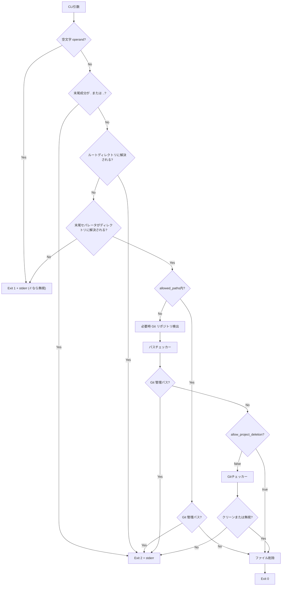
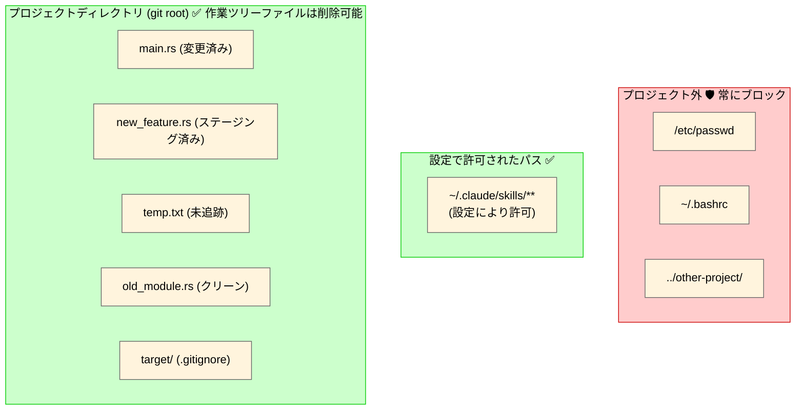
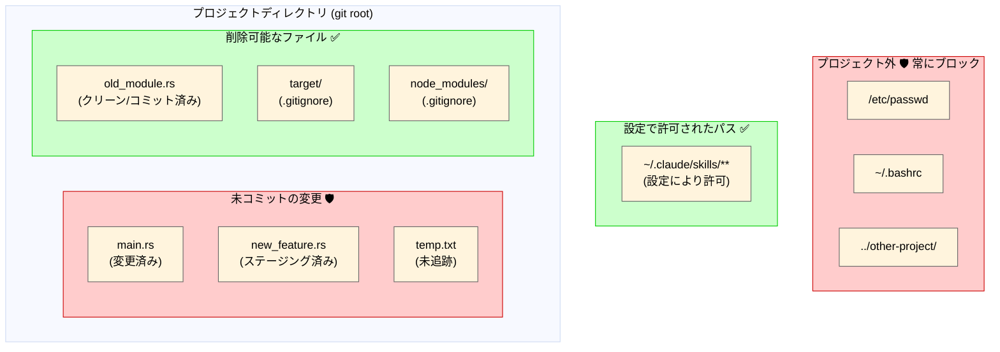

# アーキテクチャ

`safe-rm` がパスを削除してよいかをどう判定するかをまとめます。検査の順序、安全レイヤー、モードごとに削除できる範囲を扱います。[README](../README.ja.md) に戻る。

## 安全レイヤー

1. **Git 管理メタデータ保護**: `.git`、gitdir 参照ファイル、bare リポジトリの管理パス、および Git 管理メタデータを含む再帰削除は、設定に関係なく常に削除をブロック。bare リポジトリは構造マーカー（`HEAD` エントリ・`objects/`・`refs/`）で検出するため、`config` が壊れて `Repository::open_bare()` が失敗する bare リポジトリも fail-closed で保護する。再帰的なメタデータ探索でディレクトリエントリを読み取れない場合も fail-closed でブロック。
2. **パス境界チェック**: `allowed_paths` 以外のすべてのパスがプロジェクトディレクトリ（Gitリポジトリルート、Git外の場合はcwd）内に解決されることを、再帰的なメタデータ探索より先に確認。存在しない削除対象でも、既存の親ディレクトリまで canonicalize して別名パス差異（repo symlink 別名、`/var` と `/private/var` など）を吸収。削除対象エントリ（末尾 symlink を辿らない位置）と末尾まで解決した実体の両方がプロジェクト内であることを要求するため、プロジェクト外の symlink がプロジェクト内を指すケース（エントリが外）と、プロジェクト内の symlink がプロジェクト外を指すケース（実体が外）の双方をブロックする。同じ2位置判定は `allowed_paths` のマッチにも適用される。
3. **Git保護**: `allow_project_deletion = false` の場合、ダーティファイル（変更済み/ステージング済み/未追跡）の削除をブロック。未追跡ディレクトリの深い階層にあるファイルも対象。ステータス判定には cwd 由来の checker だけでなく、削除対象起点でも `GitChecker::open()` を試行し、対象を含む repo のうち最も深い workdir を持つ checker を採用する。cwd 非 Git で対象側だけ Git のケース、cwd の outer repo が nested repo を `.gitignore` で除外しているケース、cwd と別 Git の対象を指定するケースの三種のクロスリポジトリ削除でも、対象側 repo の status で fail-closed に判定する
4. **再帰チェック**: 実ディレクトリの場合、含まれるすべてのファイルを検証。ignored な子孫ファイルは削除可能だが、ignored な親ディレクトリが tracked な変更済み/ステージング済みファイルや未追跡の兄弟ファイルを隠すことはない
5. **Fail-Closed**: ディレクトリ走査中のエラー（エントリ列挙エラーを含む）、対象の metadata 種別判定エラー、`allowed_paths` 外の削除経路で必要になる `Repository::discover()` 由来の Git API エラー（壊れた `.git` / 権限不足 / I/O エラー等）、worktree の canonicalize 失敗、`NotFound` 判定時の祖先メタデータ確認エラー、解決不能な中間 symlink、および設定位置の決定失敗・設定ファイル読込/パースエラー時は削除をブロックまたは strict モードへフォールバック。`NotFound` は `.git`/bare リポジトリの祖先がなく、祖先確認自体にも成功した場合のみ非 Git として扱う。`allowed_paths` は Git 管理メタデータ保護を維持しつつ、現在ディレクトリの Git 検出成功は必須にしない
6. **不正な親ディレクトリ参照ガード**: `..` の直前成分が「実体として存在する通常ディレクトリ」でないパス（symlink・通常ファイル・存在しない・読み取り不能・特殊ファイル）は削除前に fail-closed で拒否。`link/../victim`・`missing/../victim`・`file/../victim` が字句正規化で別ファイルへすり替わって削除される経路をブロック。dangling 中間 symlink 配下のパスも削除前に拒否し、末尾の dangling symlink エントリ自体の削除は許可する
7. **エイリアスパス対策**: 包含検証と `allowed_paths` 判定では既存親ディレクトリまで canonicalize して未作成部分を再結合し、Gitチェックでは非symlinkパスを canonicalize 比較し、symlink パスは「親ディレクトリのみ canonicalize + リンク自体を判定」することで、repo symlink 別名や `/var` と `/private/var` の差異による回避を防止
8. **`.` / `..` operand の拒否**: 末尾成分が `.` または `..` の operand は、正規化・`allowed_paths` 判定・`-f` 処理より前に exit 2 でブロックする。POSIX の rm も `.` / `..` ディレクトリの削除を拒否するため、これに揃えて「置き換え前の rm より危険」な状態を作らない。削除したいディレクトリは名前で明示する（`safe-rm -r sub`）。`.hidden` や `...` のような dot 始まりのファイル名は影響を受けない
9. **空文字 operand の拒否**: 空文字 operand は `.` / `..` 判定より前に `No such file or directory`（exit 1）として拒否する。`cwd.join("")` がカレントディレクトリと等価になるため、拒否しないと `-r ""` でカレントディレクトリが消える。`-f` のときは rm と同じく黙って無視する
10. **対象メタデータの共有**: `allowed_paths` 判定・`-r` の要否・削除方式は、すべて同一の `symlink_metadata()` 結果を使う。2 回読むと、その間にファイルをディレクトリへ入れ替えることで、「非再帰 allowed エントリの直下ファイル」として許可した対象を配下ごと `remove_dir_all` させられる（後述の末尾セパレータ検証はこれより前に別途 `metadata()` を呼ぶが、生 operand がディレクトリに解決されるかを判定するだけで削除方式には影響しない）
11. **ルート operand の拒否**: ルートディレクトリに解決される operand（`/`・`//`・cwd が `/` のときの `.`）は exit 2 で拒否する。POSIX の rm も、既定で有効な GNU rm の `--preserve-root` も同じ operand を処理しない。この拒否がないと、cwd が `/` の非 Git 環境（root 実行のコンテナ等）ではプロジェクトルートが `/` になって包含検証を通過し、Git 管理メタデータ保護も `/` 自体はカバーしないため、`safe-rm -r /` がファイルシステム全体の再帰削除に入り得る。`.` / `..` の判定と同じく allowed_paths 判定や `-f` より前に評価する
12. **末尾セパレータ付き operand の検証**: POSIX では末尾セパレータは「その対象がディレクトリであること」の要求なので、rm はディレクトリとして解決できない operand を削除しない。字句正規化で末尾セパレータが落ちるため、検査しないと `file.txt/` が `file.txt` 自体の削除に、`danglink/`（リンク切れ symlink）がリンクエントリの削除に化ける。正規化前に生 operand を解決し、非ディレクトリなら `Not a directory`、解決できなければ `No such file or directory`（いずれも exit 1、rm と同じく `-f` では黙って無視）を返す。`ELOOP`（循環 symlink）や権限不足は判断不能なので `-f` でも I/O エラーとして伝播させる。ディレクトリへの symlink は引き続きディレクトリとして解決されるため、`link/` は従来どおりリンクエントリのみを削除してリンク先を残す。この検査は dangling 中間 symlink ガードより後に走るため、解決不能な中間 symlink 配下のパス（`dangling/child/`）は従来どおり exit 2 でブロックされ、`-f` でも無視されない

## ファイルシステムと削除可能スコープ

### デフォルトモード (`allow_project_deletion = true`)

| ファイル | 削除可能 | 理由 |
|----------|----------|------|
| `old_module.rs` (クリーン) | ✅ はい | プロジェクト内 |
| `target/` (無視) | ✅ はい | プロジェクト内 |
| `main.rs` (変更済み) | ✅ はい | プロジェクト内 (allow_project_deletion=true) |
| `temp.txt` (未追跡) | ✅ はい | プロジェクト内 (allow_project_deletion=true) |
| `~/.claude/skills/foo` | ✅ はい | 設定により許可（recursive） |
| `.git/` | ❌ いいえ | Git 管理メタデータは常時保護 |
| `./` または repo root に `-r` | ❌ いいえ | 再帰削除が Git 管理メタデータを含む |
| `/etc/passwd` | ❌ いいえ | プロジェクトディレクトリ外 |
| `../other-project/` | ❌ いいえ | パストラバーサルをブロック |

### 厳格モード (`allow_project_deletion = false`)

| ファイル | 削除可能 | 理由 |
|----------|----------|------|
| `old_module.rs` (クリーン) | ✅ はい | コミット済み、`git checkout` で復元可能 |
| `target/` (無視) | ✅ はい | `.gitignore` に記載、ビルド成果物 |
| `node_modules/` (無視) | ✅ はい | `.gitignore` に記載、依存関係 |
| `~/.claude/skills/foo` | ✅ はい | 設定により許可（recursive） |
| `.git/` | ❌ いいえ | Git 管理メタデータは常時保護 |
| `./` または repo root に `-r` | ❌ いいえ | 再帰削除が Git 管理メタデータを含む |
| `main.rs` (変更済み) | ❌ いいえ | 未コミットの変更が失われる |
| `new_feature.rs` (ステージング済み) | ❌ いいえ | コミット待ちの内容が失われる |
| `temp.txt` (未追跡) | ❌ いいえ | Git履歴になく、復元不可能 |
| `/etc/passwd` | ❌ いいえ | プロジェクトディレクトリ外 |
| `../other-project/` | ❌ いいえ | パストラバーサルをブロック |

**重要ポイント**:
- プロジェクト外のファイルは**常にブロック**（設定に関係なく）
- `.git` などの Git 管理メタデータは**常にブロック**（設定に関係なく）。現在のリポジトリルートの再帰削除も対象
- **デフォルトモード (`allow_project_deletion = true`)**: プロジェクト内の作業ツリーファイルは削除可能（AIエージェントに最適）
- **厳格モード (`allow_project_deletion = false`)**: クリーン（コミット済み）または無視された作業ツリーファイルのみ削除可能。ディレクトリ削除では、ディスク上に存在しない未コミットの削除（配下の `git rm` 済み=staged ファイルや worktree から削除済みの tracked ファイル）も拒否する。これらは `read_dir` ではなく Git ステータスキャッシュで検出する
- **設定で許可されたパス**は境界チェックと Git ステータスチェックをバイパスするが、Git 管理メタデータ保護はバイパスしない（`~` 展開対応）

## Git ステータス判定マトリクス

### デフォルトモード (`allow_project_deletion = true`)

| ファイルステータス | 削除可能? | 理由 |
|-------------------|-----------|------|
| すべて（プロジェクト内） | はい | `allow_project_deletion = true` はGitチェックをスキップ |
| プロジェクト外 | いいえ | 設定に関わらず常にブロック |

### 厳格モード (`allow_project_deletion = false`)

| ファイルステータス | 削除可能? | 理由 |
|-------------------|-----------|------|
| Clean | はい | コミット済みで `git checkout` で復元可能 |
| Modified | いいえ | コミットされていない変更が失われる |
| Staged | いいえ | コミット待ちの内容が失われる |
| Untracked | いいえ | Git履歴になく、復元不可能 |
| Ignored | はい | ビルド成果物、ソース管理外 |
| プロジェクト外 | いいえ | Git状態に関わらず常にブロック |

**注意**: カレントディレクトリが Git リポジトリでなくても strict チェックは無効になりません。`safe-rm` は削除対象からもリポジトリを検出し、対象を含む最も深い worktree で判定します。対象自体が Git リポジトリに属さない場合のみ Git ステータスチェックをスキップし、リポジトリ検出や worktree 解決のエラーは fail-closed でブロックします。
