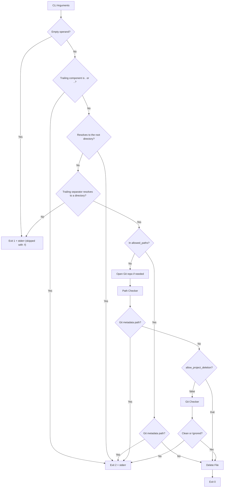
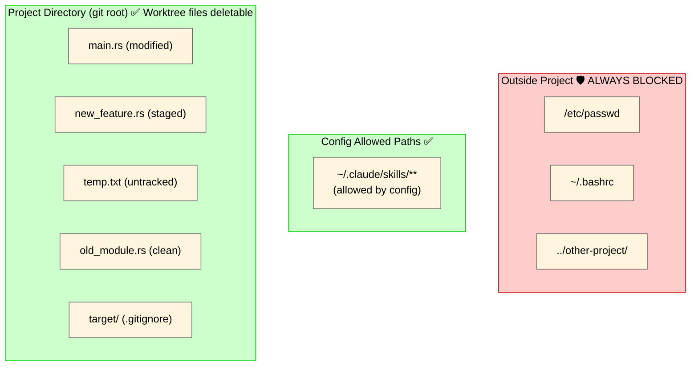
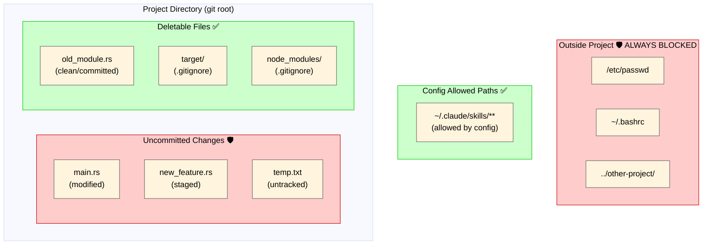

# Architecture

How `safe-rm` decides whether a path can be deleted: the order of the checks, the safety layers, and what each mode lets an agent delete. Back to the [README](../README.md).

## Safety Layers

1. **Git Metadata Protection**: Always blocks `.git`, gitdir indirection files, bare-repository administrative paths, and recursive deletion of paths that contain Git metadata, even if config would otherwise allow deletion. Bare repositories are detected by their structure markers (`HEAD` entry, `objects/`, `refs/`), so a bare repository with a corrupted `config` (where `Repository::open_bare()` fails) is still protected fail-closed. If a recursive metadata scan cannot read a directory entry, deletion is blocked fail-closed.
2. **Path Containment**: Ensures all non-`allowed_paths` paths resolve within the project directory (Git repository root, or cwd if not a Git repo) before recursive metadata scanning. For nonexistent targets, it canonicalizes the nearest existing parent to absorb alias differences (e.g. repo symlink alias, `/var` vs `/private/var`). Both the deletion entry (the trailing component, without following a trailing symlink) and the fully resolved target must lie inside the project, so an outside symlink pointing into the project (entry is outside) and an inside symlink pointing outside (target is outside) are both blocked; the same two-position check applies to `allowed_paths` matching.
3. **Git Protection**: When `allow_project_deletion = false`, blocks deletion of dirty files (modified/staged/untracked), including files nested under untracked directories. Status is evaluated using the Git repository that actually owns the target — both the cwd-side discovery and a discovery from the target itself are tried, and the deepest workdir containing the target is selected, so cross-repository deletions (cwd non-Git but target inside a nested Git repo, cwd repo ignoring a nested repo, or cwd and target belonging to different repos) are still checked fail-closed
4. **Recursive Check**: For real directories, validates all contained files. Ignored descendants remain deletable, but ignored parent directories do not hide tracked modified/staged files or untracked siblings
5. **Fail-Closed**: Any directory read failure (including entry iteration errors), target metadata classification failure, Git API error from `Repository::discover()` on non-`allowed_paths` deletion paths (e.g. corrupted `.git`, permission errors, I/O failures), worktree canonicalization failure, unreadable metadata probe while classifying a `NotFound`, an unresolvable intermediate symlink, or config location/read/parse error blocks deletion or falls back to strict mode. `NotFound` is treated as non-Git only when no `.git`/bare-repository ancestor is found and the ancestor probe itself succeeds. `allowed_paths` still enforce Git metadata protection, but they do not require current-directory Git discovery to succeed
6. **Unsafe Parent Traversal Guard**: Reject paths whose `..` would collapse a component that is not a real directory before deletion. Patterns such as `link/../victim` (symlink), `missing/../victim` (non-existent), `file/../victim` (regular file), and any component whose metadata cannot be read (permission denied, special file) are rejected fail-closed, preventing lexical normalization from silently retargeting a different on-disk file. Paths below a dangling intermediate symlink are also rejected before deletion, while deleting the dangling symlink entry itself remains allowed
7. **Alias-Path Hardening**: Path containment and `allowed_paths` matching canonicalize the nearest existing parent and reattach missing segments, while Git checks canonicalize non-symlink paths and only parent directories for symlink paths, to avoid alias-based bypasses (e.g. repo symlink alias, `/var` vs `/private/var`)
8. **`.` / `..` Operand Rejection**: Operands whose trailing component is `.` or `..` are rejected with exit code 2 before any normalization, `allowed_paths` matching, or `-f` handling, mirroring POSIX `rm`, which refuses to remove `.` or `..` directories. Name the directory explicitly (`safe-rm -r sub`) instead. Dot-prefixed filenames such as `.hidden` and `...` are unaffected
9. **Empty-Operand Rejection**: An empty operand is rejected as `No such file or directory` (exit 1) before the `.` / `..` check, because `cwd.join("")` equals `cwd` and would otherwise let `-r ""` delete the working directory. Under `-f` it is silently ignored, as `rm` does
10. **Shared Metadata Read per Target**: The `allowed_paths` decision, the `-r` requirement, and the removal method all share one and the same `symlink_metadata()` result. Reading it twice would let a file-to-directory swap between the two reads turn a target approved as "a direct child of a non-recursive allowed entry" into a `remove_dir_all` of its whole subtree. (The trailing-separator check below runs earlier and uses a separate `metadata()` call, which only decides whether the raw operand resolves to a directory and never feeds the removal method.)
11. **Root-Operand Rejection**: Operands that resolve to the root directory (`/`, `//`, or `.` when the working directory is `/`) are rejected with exit code 2, mirroring POSIX `rm` and GNU `rm`'s `--preserve-root` (enabled by default). Without this, a working directory of `/` in a non-Git environment (for example a container running as root) would make the project root `/`, so containment passes and Git metadata protection does not cover `/` itself
12. **Trailing-Separator Operand Validation**: A trailing separator is a POSIX request that the operand be a directory, so `rm` does not remove operands that fail to resolve as one. Because normalization strips the trailing separator, `file.txt/` would otherwise become a deletion of `file.txt` itself and `danglink/` (a broken symlink) a deletion of the link entry. The raw operand is resolved before normalization: non-directories yield `Not a directory` and unresolvable paths yield `No such file or directory` (both exit 1, silently ignored under `-f` just as `rm` does), while `ELOOP` and permission failures propagate as I/O errors even under `-f`. Symlinks to directories still resolve as directories, so `link/` keeps removing only the link entry and leaves the target intact. This check runs after the dangling-intermediate-symlink guard, so a path below an unresolvable intermediate symlink (`dangling/child/`) is still blocked with exit code 2 and is not ignored by `-f`

## File System and Deletable Scope

### Default Mode (`allow_project_deletion = true`)

| File | Deletable | Reason |
|------|-----------|--------|
| `old_module.rs` (clean) | ✅ Yes | Inside project |
| `target/` (ignored) | ✅ Yes | Inside project |
| `main.rs` (modified) | ✅ Yes | Inside project (allow_project_deletion=true) |
| `temp.txt` (untracked) | ✅ Yes | Inside project (allow_project_deletion=true) |
| `~/.claude/skills/foo` | ✅ Yes | Allowed by config (recursive) |
| `.git/` | ❌ No | Git administrative metadata is always protected |
| `./` or repo root with `-r` | ❌ No | Recursive deletion would include Git administrative metadata |
| `/etc/passwd` | ❌ No | Outside project directory |
| `../other-project/` | ❌ No | Path traversal blocked |

### Strict Mode (`allow_project_deletion = false`)

| File | Deletable | Reason |
|------|-----------|--------|
| `old_module.rs` (clean) | ✅ Yes | Committed, recoverable via `git checkout` |
| `target/` (ignored) | ✅ Yes | In `.gitignore`, build artifacts |
| `node_modules/` (ignored) | ✅ Yes | In `.gitignore`, dependencies |
| `~/.claude/skills/foo` | ✅ Yes | Allowed by config (recursive) |
| `.git/` | ❌ No | Git administrative metadata is always protected |
| `./` or repo root with `-r` | ❌ No | Recursive deletion would include Git administrative metadata |
| `main.rs` (modified) | ❌ No | Uncommitted changes would be lost |
| `new_feature.rs` (staged) | ❌ No | Pending commit would be lost |
| `temp.txt` (untracked) | ❌ No | Not in Git history, unrecoverable |
| `/etc/passwd` | ❌ No | Outside project directory |
| `../other-project/` | ❌ No | Path traversal blocked |

**Key Points**:
- Files outside the project are **always blocked**, regardless of settings
- Git administrative metadata such as `.git` is **always blocked**, regardless of settings; this includes recursive deletion of the current repository root
- **Default mode (`allow_project_deletion = true`)**: Worktree files inside the project can be deleted (ideal for AI agents)
- **Strict mode (`allow_project_deletion = false`)**: Only clean (committed) or ignored worktree files can be deleted. Deleting a directory also rejects uncommitted deletions that no longer exist on disk (a `git rm`-staged or worktree-deleted tracked file under it), since those are detected via the Git status cache rather than `read_dir`
- **Config allowed paths** bypass containment and Git-status checks, but not Git metadata protection (supports `~` expansion)

## Git Status Decision Matrix

### Default Mode (`allow_project_deletion = true`)

| File Status | Deletable? | Reason |
|-------------|------------|--------|
| Any (inside project) | Yes | `allow_project_deletion = true` skips Git checks |
| Outside project | No | Always blocked regardless of settings |

### Strict Mode (`allow_project_deletion = false`)

| File Status | Deletable? | Reason |
|-------------|------------|--------|
| Clean | Yes | Committed and recoverable via `git checkout` |
| Modified | No | Uncommitted changes would be lost |
| Staged | No | Pending commit would be lost |
| Untracked | No | Not in Git history, unrecoverable |
| Ignored | Yes | Build artifacts, not source controlled |
| Outside project | No | Always blocked regardless of Git status |

**Note**: A non-Git current directory does not disable strict checks. `safe-rm` also discovers a repository from each deletion target and selects the deepest worktree containing it. Git status checks are skipped only when the target itself is not in a Git repository; discovery and worktree-resolution errors fail closed.
